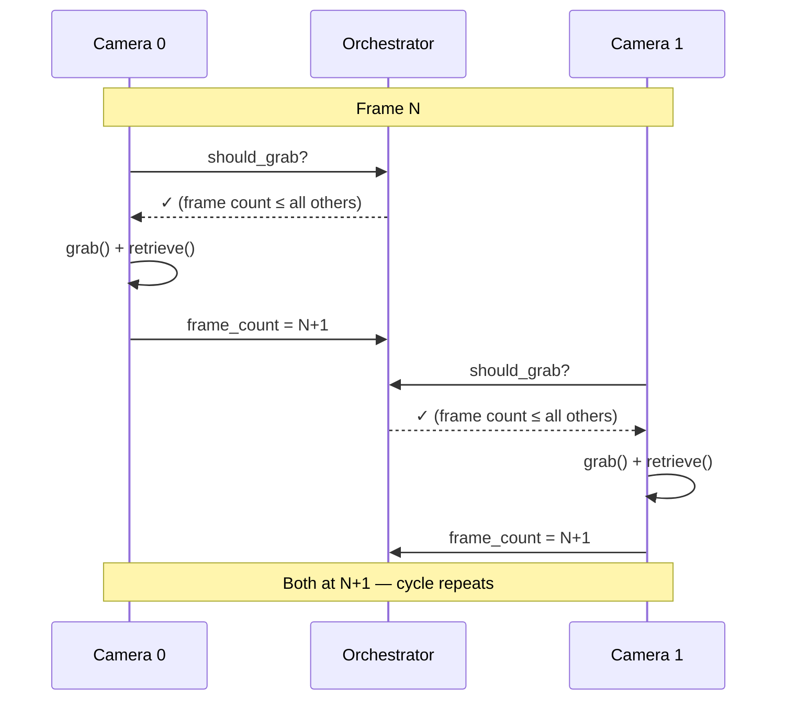

import CoreFeatureHeader from '@site/src/components/CoreFeatureHeader';
import {getFeatureById} from '@site/src/data/core-features';

<CoreFeatureHeader feature={getFeatureById('frame-perfect-sync')} />

## The problem

Most multi-camera setups suffer from **inter-camera drift**. Each USB camera has its own internal clock and delivers frames at its own pace. Camera A might produce 30.01 fps while Camera B runs at 29.97 fps. Over a 10-minute recording, that tiny difference compounds — the cameras end up tens of frames apart, and "frame 1000" from Camera A no longer corresponds to the same moment as "frame 1000" from Camera B.

This makes downstream processing (triangulation, 3D reconstruction, motion capture) unreliable or impossible without complex post-hoc alignment.

## How SkellyCam solves it

SkellyCam uses a **frame-count-gated capture protocol**. Each camera runs in its own process with its own capture loop, but a shared `CameraOrchestrator` gates when each camera is allowed to grab its next frame:

1. **Gate check** — Before each grab, a camera asks the orchestrator: "can I proceed?" The answer is **yes** only when that camera's frame count is the lowest (or tied for lowest) among all cameras in the group.

2. **Grab** — Once gated, the camera calls OpenCV's `grab()`, which latches the sensor image in the driver's buffer without transferring pixel data. Because `grab()` is fast and all cameras are gated to the same frame count, the temporal spread across cameras is minimal.

3. **Retrieve** — The camera calls `retrieve()` to decode the latched frame into a numpy array.

4. **Increment** — The camera's frame count is updated, which may ungate other cameras waiting to proceed.

The key insight: no camera ever gets more than **one frame ahead** of any other. This maintains lock-step progression without requiring an explicit centralized barrier.

## During recording

Each camera's `cv2.VideoWriter` runs in the camera's own process. The orchestrator tracks shared `first_recording_frame_number` and `last_recording_frame_number` values. Because all cameras progress in lock-step, recording starts and stops at the same frame boundary, and the output videos are **guaranteed to have identical frame counts**.

## What this means for you

If you're building on top of SkellyCam — whether for motion capture, multi-view stereo, or any other multi-camera application — you can treat the frame index as a reliable temporal identifier across all cameras. Frame 500 from Camera A and frame 500 from Camera B were captured at approximately the same instant. No alignment step needed.
