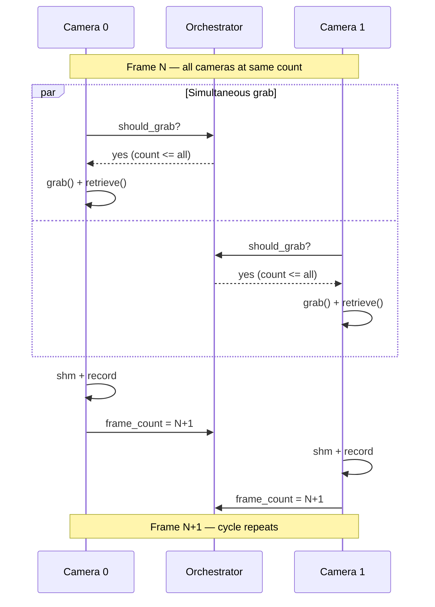

import { AiGeneratedBanner, CoreFeatureHeader, Tip } from '@freemocap/skellydocs';
import config from '../../content.config';

<AiGeneratedBanner humanCurated />

<CoreFeatureHeader feature={config.features.find(f => f.id === 'frame-perfect-sync')} repoUrl="https://github.com/freemocap/skellycam" />

## The problem

A camera captures light from a particular area at a particular time — it is a spatiotemporal measurement instrument. When you use multiple cameras together, you are making multiple simultaneous measurements of the same scene. For those measurements to be scientifically meaningful, they must be temporally aligned: "frame N" from every camera must correspond to the same instant in the real world.

The image itself defines the *spatial* aspects of the data, with fidelity determined by the camera sensor, lens, environment, and settings. The timestamps define the *temporal* aspect. Within the [FreeMoCap](https://freemocap.org) pipeline, extracting quantified 2D spatial information (e.g. skeleton joint positions) is handled by [skellytracker](https://github.com/freemocap/skellytracker). SkellyCam's focus is the temporal dimension: ensuring multi-camera frames are precisely synchronized in time.

USB webcams have no built-in synchronization mechanism. Each camera runs on its own internal clock, grabs frames at its own pace, and has no awareness of other cameras in the system. Without active coordination, the cameras drift apart — and the further apart they drift, the less meaningful any cross-camera comparison becomes. For applications like multi-view 3D triangulation (as used in [FreeMoCap](https://freemocap.org)), temporal misalignment directly degrades the precision of the reconstructed 3D points.

SkellyCam/FreeMoCap v1.* handled this problem by post-hoc synchronization of the independently recorded videos, inserting duplicate frames to handle the inherent desync. In addition to that issue, the post-hoc synchronization method makes real-time synchronized streaming of multi-camera images impossible. This technical challenge was the core driver of the development of the SkellyCam v2.* application.

:::info USB webcam limitation
Even with perfect software synchronization, there is an inherent hardware limitation: the actual sensor exposure timing is not controllable via software for standard USB webcams. In practice, this means there is an unmeasurable time spread of approximately **+/- half a frame duration** across cameras. For a 30 fps camera, that's roughly +/- 16 ms. See the [sub-frame synchronization issue](https://github.com/freemocap/skellycam/issues/91) for ongoing work toward hardware-triggered synchronization.
:::

## The Python challenge

SkellyCam is written in Python, which adds specific engineering challenges:

- **The GIL** — Python's Global Interpreter Lock means only one thread can execute Python bytecode at a time. Multi-threading is not sufficient for parallel camera I/O.
- **Blocking I/O** — Reading frames from cameras and writing video to disk are both potentially blocking operations. If one camera's I/O blocks, it must not affect other cameras.
- **Process isolation** — To solve both problems, each camera runs in its own `multiprocessing.Process`. This gives each camera its own Python interpreter, its own GIL, and complete isolation from other cameras.

The architecture is designed so that nothing — not disk I/O, not video encoding, not real-time streaming to the UI — can interfere with the core frame grab timing.

:::info Why Python?
If Python has so many challenges for real-time camera work, why use it? First and most practically, it's the language the developers knew best. Second, Python's REPL and debugger let you pause execution at any point during runtime and inspect the full application state — this is invaluable for development and provides a window into the deep internals of the application, even for less experienced users (student-like folks, Python-only newcomers, etc.). At some point we'll likely move to a compiled language (C/C++, Rust, or Go), but probably not until SkellyCam 3.*!
:::

## How SkellyCam solves it

Because SkellyCam treats cameras as empirical measurement instruments, the synchronization protocol is designed to protect the scientific validity of the captured data.

SkellyCam uses a **frame-count-gated capture protocol**. Each camera runs in its own process with its own capture loop, but a shared `CameraOrchestrator` gates when each camera is allowed to grab its next frame.

The capture loop for each camera, on every iteration:

1. **Update checks** — Check for pause commands, config updates, and recording info
2. **Pause gate** — If paused, spin-wait (1 ms) until unpaused
3. **<Tip shortInfo="The orchestrator's should_grab_by_id() returns true only when this camera's frame count is the lowest (or tied for lowest) among all cameras." longInfo="This gate is the core of SkellyCam's synchronization protocol. All cameras poll concurrently, passing the gate at approximately the same time." href="/docs/technical/frame-synchronization#the-synchronization-gate">Synchronization gate</Tip>** — Ask the orchestrator: "can I proceed?" The answer is **yes** only when this camera's frame count is the lowest (or tied for lowest) among all cameras. If any camera is behind, busy-wait (10 &mu;s polls) until it catches up
4. **Grab** — Call <Tip text="grab() latches the sensor image in the driver's buffer without decoding it. This two-phase grab/retrieve split minimizes the time window between cameras.">cv2.VideoCapture.grab()</Tip>, which latches the sensor image in the driver's buffer. Because all cameras pass the gate at roughly the same frame count, grabs happen in close temporal proximity
5. **Retrieve** — Call `cv2.VideoCapture.retrieve()` to decode the latched frame into a numpy array
6. **Recording flags** — Read `should_record_frame` and `should_finish_recording` from the orchestrator **atomically, before unsetting the grabbing_frame flag** (this prevents race conditions at recording boundaries)
7. **<Tip shortInfo="A region of memory shared between the camera worker process and the main server process, avoiding expensive data copies." longInfo="Ring buffers use overwrite semantics: if the streaming consumer falls behind, old frames are silently overwritten rather than blocking the camera capture." href="/docs/technical/architecture#shared-memory-ring-buffers">Shared memory</Tip>** — Copy the frame to a shared memory ring buffer (making it available for real-time streaming without blocking)
8. **Record** — If the recording flag is set, write the frame to the `cv2.VideoWriter`
9. **Increment** — Update the camera's frame count, which may ungate other cameras waiting to proceed

The key insight: no camera ever gets more than **one frame ahead** of any other. This maintains lock-step progression without requiring an explicit centralized barrier.

*This is a simplified view of the capture sequence. For the full architecture diagram including all process boundaries and data flows, see [Architecture](/docs/technical/architecture).*

## During recording

Each camera's `cv2.VideoWriter` runs in the camera's own process. The orchestrator tracks shared `first_recording_frame_number` and `last_recording_frame_number` values as `multiprocessing.Value` integers. Because all cameras progress in lock-step, recording starts and stops at the same frame boundary, and the output videos are **guaranteed to have identical frame counts**.

The recording flags are read atomically within the capture loop — immediately after the frame grab and before the `grabbing_frame` flag is cleared. This careful ordering prevents off-by-one errors at recording start and stop boundaries.

Videos always save completely, even if the frontend is lagging, running at a different frame rate, or disconnected entirely. The recording pipeline is completely independent of the streaming pipeline.

## What this means for you

If you're building on top of SkellyCam — whether for motion capture, multi-view stereo, or any other multi-camera application — you can treat the frame index as a reliable temporal identifier across all cameras. Frame 500 from Camera A and frame 500 from Camera B were captured at approximately the same instant. No post-hoc synchronization is necessary (but its always worth checking! Try turing a light on/off in view of all cameras, load the recording into the 'playback' tab, and check that light shows up on the same frame for all cameras) .

For a deep technical dive into the capture loop internals, see the [Frame Synchronization](/docs/technical/frame-synchronization) reference.
