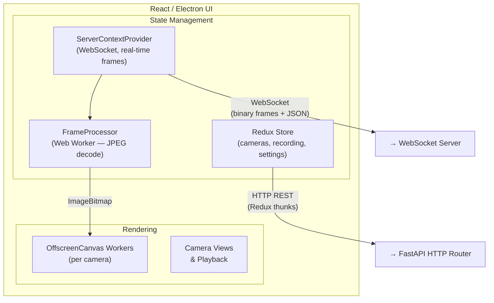
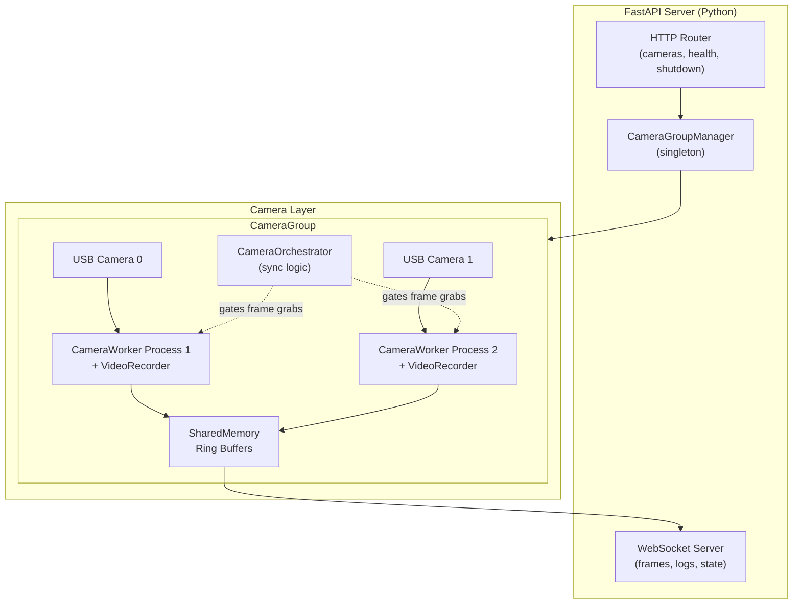
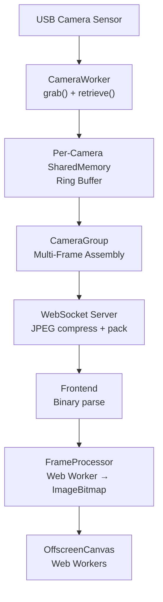

import { AiGeneratedBanner } from '@freemocap/skellydocs';

<AiGeneratedBanner />

# Architecture

## System Overview

SkellyCam is a client-server application with two main components:

1. **Python Server** (`skellycam/`) — A FastAPI/Uvicorn server that manages cameras, captures frames, records video, and streams data over WebSocket.
2. **React/Electron UI** (`skellycam-ui/`) — A frontend that displays live camera feeds, provides configuration controls, and manages recordings.

What is a client-server application?

A client-server application splits work between two programs: a **server** that does the heavy lifting (in this case, controlling cameras and processing video) and a **client** that provides the user interface. They communicate over a network protocol — here, HTTP for commands and WebSocket for streaming data. This separation means you could replace the UI with your own, or run the server on a different machine entirely.

Learn more: [Client-server model (Wikipedia)](https://en.wikipedia.org/wiki/Client%E2%80%93server_model)

### UI Layer

### Server Layer

What is FastAPI?

[FastAPI](https://fastapi.tiangolo.com/) is a modern Python web framework for building APIs. It runs on [Uvicorn](https://www.uvicorn.org/), an ASGI server. SkellyCam uses FastAPI for its HTTP endpoints (camera control, health checks) and WebSocket connections (live frame streaming).

Learn more: [FastAPI documentation](https://fastapi.tiangolo.com/)

## Hot, Hard, and Soft Loops

SkellyCam's architecture is organized around a core principle: **protect the time-critical camera operations from everything else**. We classify operations into three categories:

### Hot loops — time-critical

Operations where any delay directly degrades temporal fidelity. These are the camera capture loops: reading from the camera sensor, frame synchronization gating, and shared memory writes. Hot loops run in isolated processes with minimal dependencies. Nothing is allowed to block them.

The entire [frame synchronization system](/docs/technical/frame-synchronization) is a hot loop.

### Hard loops — correctness-critical

Operations where the math must be internally correct, but timing is flexible. Timestamp computation, recording boundary decisions, and post-recording finalization fall here. A few milliseconds of delay is fine, but an off-by-one error in frame counting is not.

### Soft loops — best-effort

Operations where a few milliseconds of jitter or delay is acceptable. The UI rendering pipeline, WebSocket streaming to the frontend, and log forwarding are all soft loops. If the frontend lags behind, frames are dropped from the stream — but the recording and capture pipelines are never affected.

This classification drives key architectural decisions: each camera runs in its own process (protecting hot loops from the GIL and from each other), shared memory ring buffers use overwrite semantics (soft loop consumers can't block hot loop producers), and recording happens synchronously within the camera process (keeping it in the hot loop rather than adding IPC latency).

## Process Model

SkellyCam uses Python's `multiprocessing` module to run each camera in its own process. This avoids the GIL and ensures that slow cameras do not block fast ones.

What is the GIL?

The Global Interpreter Lock (GIL) is a mechanism in CPython that allows only one thread to execute Python bytecode at a time. This means Python threads cannot achieve true parallelism for CPU-bound work. By using separate processes instead of threads, each camera gets its own Python interpreter and its own GIL, enabling true parallel execution.

Learn more: [GIL (Python Wiki)](https://wiki.python.org/moin/GlobalInterpreterLock)

### Main Process

The main process runs the FastAPI/Uvicorn server and manages:

- **WorkerRegistry** — Tracks all spawned worker processes and provides a heartbeat mechanism for health monitoring.
- **CameraGroupManager** — Singleton that creates/destroys camera groups and routes API calls to the correct group.
- **WebSocket Server** — Reads synchronized multi-frame data from shared memory, JPEG-compresses each camera's image, and sends binary payloads to connected clients. Also sends JSON messages for logs, state updates, and framerate statistics.

### Camera Worker Processes

Each camera gets its own `CameraWorker` running in a separate `multiprocessing.Process`:

1. **OpenCV Capture Loop** — Calls `cv2.VideoCapture.grab()` and `.retrieve()` in a coordinated two-phase protocol, with synchronization gating between cameras.
2. **Frame Metadata** — Each frame is annotated with high-resolution `perf_counter_ns` timestamps at multiple lifecycle stages (pre-grab, post-grab, pre-retrieve, post-retrieve, pre/post shared memory copy, pre/post record).
3. **Shared Memory Write** — The raw frame data is written to a shared memory ring buffer, making it available to the main process without copying.
4. **Video Recording** — When recording is active, frames are written to `cv2.VideoWriter` directly in the camera process, gated by the orchestrator's recording frame boundaries.

For the full capture loop internals, see the [Frame Synchronization](/docs/technical/frame-synchronization) reference.

## Data Flow: Capture to Display

1. **Camera → SharedMemory** — Each camera worker writes its frame into a per-camera shared memory ring buffer.
2. **SharedMemory → MultiFrame buffer** — The camera group reads frames from all cameras and writes a synchronized multi-frame to a second shared memory buffer.
3. **MultiFrame → WebSocket** — The WebSocket server reads the latest multi-frame, JPEG-compresses each camera's image (quality 80, resized to match client display dimensions or 50% of native resolution), and packs them into a binary payload.
4. **WebSocket → Frontend** — The binary payload is sent over WebSocket. The frontend's `FrameProcessor` Web Worker parses the binary protocol and creates `ImageBitmap` objects. These are transferred to per-camera `OffscreenCanvas` workers for GPU-accelerated rendering.

## Data Flow: Recording

When recording is active:

1. Each camera worker writes frames directly to a `cv2.VideoWriter` in its own process, gated by `should_record_frame_number()` checks against the orchestrator's shared recording frame boundaries.
2. Per-frame timestamps are accumulated in memory and flushed to CSV when recording stops.
3. After recording completes, the `RecordingFinalizer` processes the timestamp data, computes inter-camera synchronization statistics, and saves summary reports.

## IPC Mechanisms

### Shared Memory Ring Buffers

Frame data is transferred between processes using `multiprocessing.shared_memory.SharedMemory`. Ring buffers allow the producer (camera worker) and consumer (main process) to operate independently. Critically, the ring buffer supports **overwrite semantics**: if the consumer (streaming to the frontend) falls behind, old frames are silently overwritten rather than blocking the producer (camera capture). This is what protects the hot loop from soft loop latency.

What is shared memory?

Shared memory is a region of memory that multiple processes can access directly, without copying data between them. This is much faster than sending data through pipes or queues. In SkellyCam, camera frames (which can be several megabytes each) are written to shared memory by the camera process and read by the main process for streaming — all without any data copying.

Learn more: [Shared memory (Wikipedia)](https://en.wikipedia.org/wiki/Shared_memory)

### PubSub

A lightweight publish/subscribe system built on `multiprocessing.Queue` is used for non-frame data like framerate updates, recording info, and camera setting changes.

### Global Kill Flag

A `multiprocessing.Value("b", False)` shared across all processes. When set to `True`, all camera workers and the server begin graceful shutdown.

## Frontend Architecture

The React UI separates real-time streaming data from user-driven state:

- **Redux Toolkit** — Manages user-driven state: camera configurations, recording status, settings, and theme. HTTP API calls to the server are dispatched as Redux async thunks.
- **ServerContextProvider** (React Context) — Manages the WebSocket connection and real-time frame data. This is deliberately kept outside Redux to avoid triggering React renders on every frame.
- **FrameProcessor** (Web Worker) — Parses the binary multi-frame protocol and decodes JPEG blobs into `ImageBitmap` objects, all off the main thread.
- **CanvasManager** — Manages `OffscreenCanvas` + `Worker` pairs for each camera, enabling GPU-accelerated rendering without blocking the main thread.
- **Non-Redux stores** — `FramerateStore` and `LogStore` are ref-based mutable stores for high-frequency data that doesn't need to trigger React renders.
- **Material UI** — Component library for the control panels, tree views, and layout.
- **i18next** — Internationalization with community-maintained translation files.
