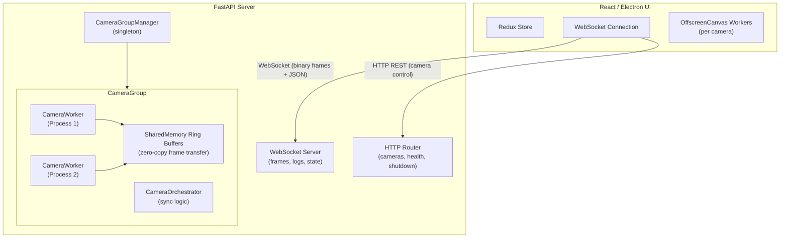
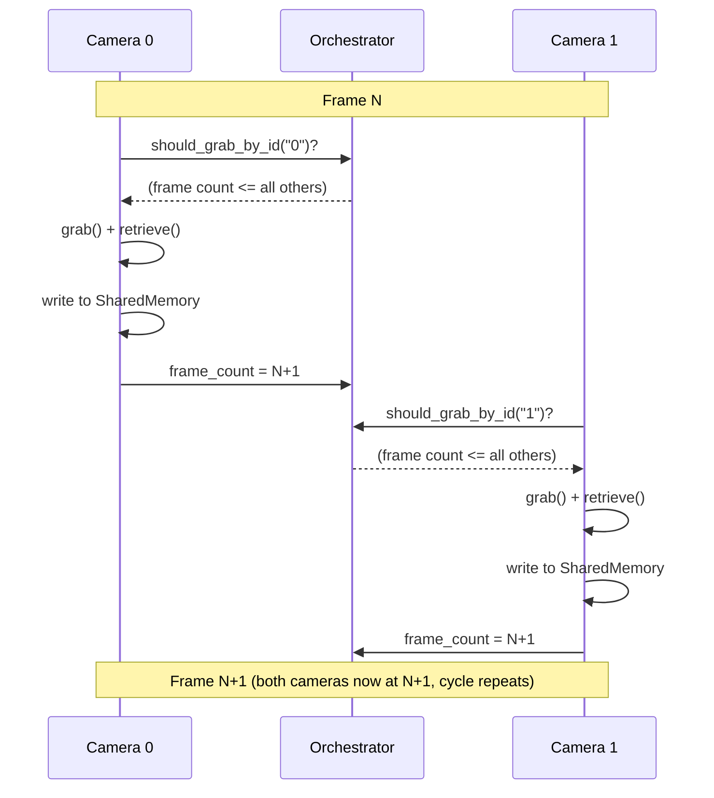
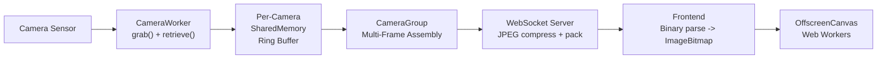

import { AiGeneratedBanner } from '@freemocap/skellydocs';

<AiGeneratedBanner />

# Architecture

## System Overview

SkellyCam is a client-server application with two main components:

1. **Python Server** (`skellycam/`) — A FastAPI/Uvicorn server that manages cameras, captures frames, records video, and streams data over WebSocket.
2. **React/Electron UI** (`skellycam-ui/`) — A frontend that displays live camera feeds, provides configuration controls, and manages recordings.

## Process Model

SkellyCam uses Python's `multiprocessing` module to run each camera in its own process. This avoids the GIL and ensures that slow cameras do not block fast ones. Frame-perfect synchronization is the system's primary design goal — every architectural decision serves it.

### Main Process

The main process runs the FastAPI/Uvicorn server and manages:

- **WorkerRegistry** — Tracks all spawned worker processes and provides a heartbeat mechanism for health monitoring.
- **CameraGroupManager** — Singleton that creates/destroys camera groups and routes API calls to the correct group.
- **WebSocket Server** — Sends synchronized multi-frame binary payloads (one image per camera per frame event) and JSON messages (logs, state, framerate updates) to connected clients.

### Camera Worker Processes

Each camera gets its own `CameraWorker` running in a separate `multiprocessing.Process`:

1. **OpenCV Capture Loop** — Calls `cv2.VideoCapture.grab()` and `.retrieve()` in a coordinated two-phase protocol, grabbing frames as fast as the camera allows.
2. **Frame Metadata** — Each frame is annotated with high-resolution `perf_counter_ns` timestamps at multiple lifecycle stages (pre-grab, post-grab, pre-retrieve, post-retrieve, pre/post copy to shared memory, pre/post record).
3. **Shared Memory Write** — The raw frame data is written to a shared memory ring buffer, making it available to the main process without copying.

### Frame Synchronization — The Core Protocol

The `CameraOrchestrator` enforces frame-perfect synchronization through a **frame-count-gated capture** protocol. Each camera runs its own independent capture loop, but the orchestrator gates when each camera is allowed to grab its next frame:

1. **Gate check** — Before each grab, a camera calls `should_grab_by_id()` on the orchestrator. This returns `True` only when the camera's frame count is the lowest (or tied for lowest) among all cameras in the group. If any other camera is behind, the requesting camera busy-waits (polling every 10us) until the lagging camera catches up.
2. **Grab** — Once gated, the camera calls `cv2.VideoCapture.grab()`, which latches the sensor image in the driver's buffer without transferring pixel data. Because `grab()` is fast, and all cameras are gated to proceed at roughly the same frame count, the temporal spread across cameras is minimal.
3. **Retrieve** — The camera calls `cv2.VideoCapture.retrieve()` to decode the latched frame into a numpy array written into a pre-allocated recarray.
4. **Write to shared memory** — The frame data is written to the camera's shared memory ring buffer.
5. **Increment frame count** — The camera's status frame count is updated, which may ungate other cameras waiting to proceed.

This distributed gating ensures no camera ever gets more than one frame ahead of the others, maintaining lock-step progression without requiring an explicit centralized barrier.

The result: consumers (WebSocket stream, video recorder, frontend) always see exactly one frame per camera per event, and all frames within an event share the same frame number. Recorded videos are guaranteed to have the same frame count.

**During recording**, each camera's `cv2.VideoWriter` runs in the camera's own process, writing frames in the order they are captured. The orchestrator tracks `first_recording_frame_number` and `last_recording_frame_number` as shared `multiprocessing.Value` integers. Each camera checks these against its current frame number to decide whether to record or finalize. Because all cameras progress in lock-step, recording starts and stops at the same frame boundary, and the output videos are guaranteed to have identical frame counts.

**During playback**, the frontend uses a leader-based synchronization strategy. The first video element is elected as the "leader" and plays via the browser's native `.play()` for smooth hardware-decoded rendering. A `requestAnimationFrame` loop reads `leader.currentTime` to derive the authoritative frame number (time x fps). Follower videos are drift-corrected only when they diverge beyond a 2-frame tolerance, avoiding unnecessary seeks that cause stutter. When paused or frame-stepping, all `<video>` elements have their `currentTime` set directly and simultaneously. Frame overlays are updated via direct DOM refs to avoid React re-renders during playback.

## Data Flow: Capture to Display

1. **Camera -> SharedMemory** — Each camera worker writes its frame into a per-camera shared memory ring buffer.
2. **SharedMemory -> MultiFrame buffer** — The camera group reads frames from all cameras and writes a synchronized multi-frame to a second shared memory buffer.
3. **MultiFrame -> WebSocket** — The WebSocket server reads the latest multi-frame, JPEG-compresses each camera's image (quality 80, resized to match client display dimensions or 50% of native resolution), and packs them into a binary payload.
4. **WebSocket -> Frontend** — The binary payload is sent over WebSocket. The frontend parses the binary protocol, creates `ImageBitmap` objects, and renders to `OffscreenCanvas` via Web Workers.

## Data Flow: Recording

When recording is active:

1. Each camera worker writes frames directly to a `cv2.VideoWriter` in its own process, gated by `should_record_frame_number()` checks against the orchestrator's shared recording frame boundaries.
2. Per-frame timestamps are accumulated in memory and flushed to CSV when recording stops.
3. After recording completes, the `RecordingFinalizer` processes the timestamp data, computes inter-camera synchronization statistics, and saves summary reports.

## IPC Mechanisms

### Shared Memory Ring Buffers

Frame data is transferred between processes using `multiprocessing.shared_memory.SharedMemory`. Ring buffers allow the producer (camera worker) and consumer (main process) to operate independently without blocking.

### PubSub

A lightweight publish/subscribe system built on `multiprocessing.Queue` is used for non-frame data like framerate updates, recording info, and camera setting changes.

### Global Kill Flag

A `multiprocessing.Value("b", False)` shared across all processes. When set to `True`, all camera workers and the server begin graceful shutdown.

## Frontend Architecture

The React UI uses:

- **Redux Toolkit** — Global state management for cameras, recording, framerate data, logs, and theme.
- **WebSocket Connection** — Persistent connection to the server with automatic reconnection and heartbeat.
- **FrameProcessor** — Parses the binary multi-frame protocol and creates `ImageBitmap` objects.
- **CanvasManager** — Manages `OffscreenCanvas` + `Worker` pairs for each camera, enabling GPU-accelerated rendering without blocking the main thread.
- **Leader-Based Frame-Locked Playback** — The playback page elects the first video as the "leader" whose native `.play()` drives canonical time. A `requestAnimationFrame` loop reads `leader.currentTime` and derives the frame number. Follower videos are drift-corrected only when they diverge beyond 2 frames. When paused or frame-stepping, `video.currentTime` is set directly on all elements simultaneously. Frame overlays are updated via direct DOM refs to avoid React re-renders during playback.
- **Material UI** — Component library for the control panels, tree views, and layout.
- **i18next** — Internationalization with community-maintained translation files.
