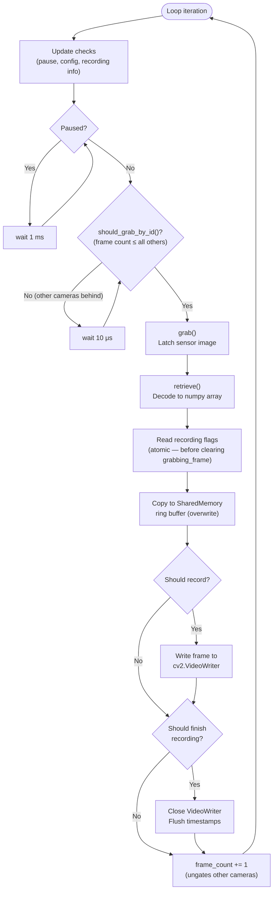
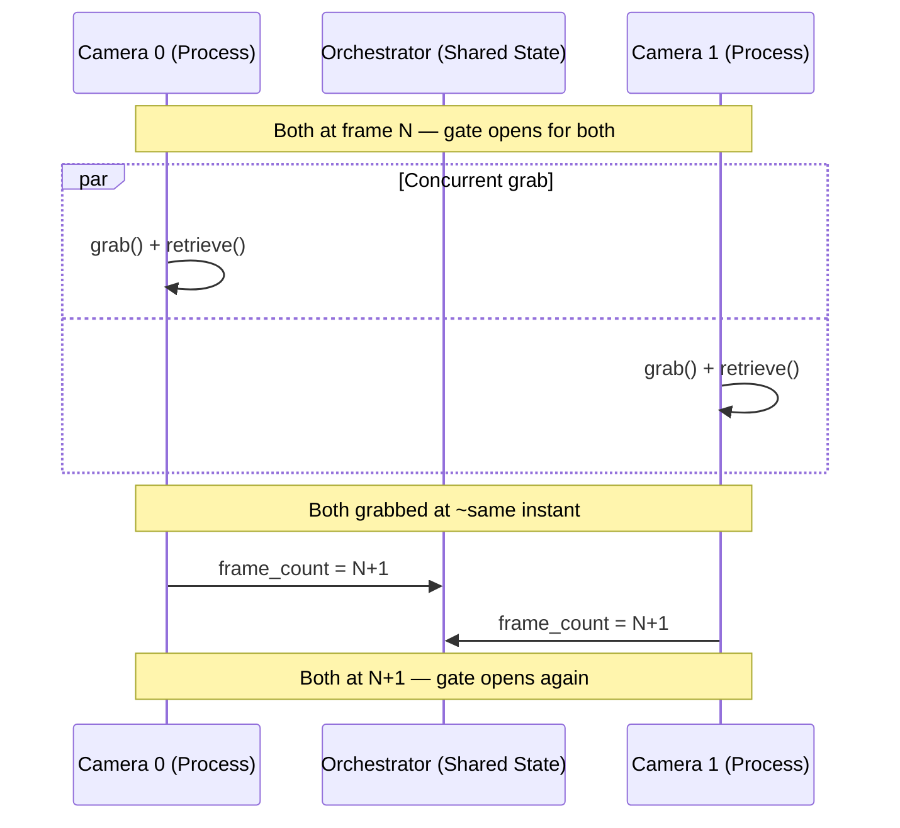

import { AiGeneratedBanner } from '@freemocap/skellydocs';

<AiGeneratedBanner />

# Frame Synchronization Method

This page is a technical deep-dive into SkellyCam's frame-count-gated capture protocol. For a higher-level overview, see [Frame Perfect Sync](/docs/core/frame-perfect-sync).

The entire frame synchronization system is a **hot loop** — every operation in the capture cycle is time-critical, and any delay directly affects temporal fidelity.

## The capture loop

Each camera runs the following loop in its own `multiprocessing.Process`. The loop runs continuously from the moment cameras are connected until they are shut down.



### Step-by-step

| Step | Operation | Code location | Notes |
|------|-----------|---------------|-------|
| 1 | **Update checks** | `camera_loop_update_checks.py` | Checks for pause commands, config updates, and new recording info |
| 2 | **Pause gate** | `opencv_camera_loop.py:66-68` | If `is_paused`, spin-wait 1 ms and skip to next iteration |
| 3 | **Sync gate** | `camera_orchestrator.py:93-106` | `should_grab_by_id()` returns `True` only when this camera's frame count is &le; all others |
| 4 | **Grab** | `opencv_get_frame.py` | `cv2.VideoCapture.grab()` — latches sensor image in driver buffer |
| 5 | **Retrieve** | `opencv_get_frame.py` | `cv2.VideoCapture.retrieve()` — decodes frame into pre-allocated numpy recarray |
| 6 | **Recording flags** | `opencv_camera_loop.py:90-94` | Read flags **before** clearing `grabbing_frame` to prevent race conditions |
| 7 | **Shared memory** | `camera_shared_memory_ring_buffer.py` | `put_frame(overwrite=True)` — streaming consumers can't block capture |
| 8 | **Record** | `handle_video_recording_loop.py` | Write to `cv2.VideoWriter` if `should_record_frame` is set |
| 9 | **Finish** | `handle_video_recording_loop.py` | Close writer and flush if `should_finish_recording` is set |
| 10 | **Increment** | `opencv_camera_loop.py` | Update `frame_count`, ungating other cameras |

## The synchronization gate

The `CameraOrchestrator` enforces frame-level synchronization via `should_grab_by_id()`:

```python
def should_grab_by_id(self, camera_id) -> bool:
    if not self.all_ready:
        return False
    return self._all_camera_counts_greater_than_or_equal_to_camera(camera_id)
```

A camera may only grab its next frame when its frame count is the **lowest** (or tied for lowest) among all cameras. This ensures no camera ever gets more than one frame ahead of any other.

All cameras poll this gate concurrently — when they all reach the same frame count, they all pass the gate at approximately the same time and grab their next frames in close temporal proximity.



## Recording boundaries

Recording start and stop are coordinated across all cameras through shared `multiprocessing.Value` integers managed by the orchestrator:

- `first_recording_frame_number` — Set when a recording starts. Initially `-1`.
- `last_recording_frame_number` — Set when a recording stops. Initially `-1`.

Each camera checks these values on every frame:

```python
def should_record_frame_number(self, frame_number: int) -> tuple[bool, bool]:
    should_record_frame = False
    should_finish_recording = False

    if self.first_recording_frame_number.value != -1:
        if frame_number >= self.first_recording_frame_number.value:
            should_record_frame = True

    if self.last_recording_frame_number.value != -1:
        if frame_number < self.last_recording_frame_number.value:
            should_record_frame = True
        elif frame_number >= self.last_recording_frame_number.value:
            should_record_frame = False
            should_finish_recording = True

    return should_record_frame, should_finish_recording
```

### Off-by-one prevention

The recording flags are read **immediately after the frame grab and before the `grabbing_frame` flag is cleared**:

```python
# CRITICAL: Get recording flags BEFORE unsetting 'grabbing_frame'
# to avoid potential race-condition-generating flag setting gaps
(should_record_frame,
 should_finish_recording) = orchestrator.should_record_frame_number(
    frame_number=frame_rec_array.frame_metadata.frame_number[0])

self_status.grabbing_frame.value = False  # Only AFTER reading flags
```

This ordering prevents a race condition where the recording boundary could change between reading the flag and using it. Because all cameras are in lock-step, they all cross the recording boundary at the same frame number, producing videos with identical frame counts.

## Pause and config updates

### Pause

Pause is controlled by the orchestrator's `pause()` / `unpause()` methods, which set `should_pause` on all cameras and wait for `is_paused` to propagate:

```python
if self_status.is_paused.value:
    wait_1ms()
    continue  # Skip frame grab entirely
```

When paused, cameras spin-wait at 1 ms intervals. This is responsive enough for interactive use while consuming minimal CPU.

### Config updates

Config updates (resolution, exposure, codec changes) are checked at the start of each loop iteration:

```python
if not update_camera_settings_subscription.empty():
    self_status.updating.value = True
    extracted_config = apply_camera_configuration(cv2_video_capture, new_config)
    self_status.updating.value = False
```

While a camera is updating (`updating.value = True`), the orchestrator's `all_ready` property returns `False`, which prevents all cameras from grabbing. This ensures config changes don't happen mid-frame-cycle.

## Camera status flags

Each camera maintains a set of `multiprocessing.Value` boolean flags for inter-process coordination:

| Flag | Purpose |
|------|---------|
| `connected` | Camera hardware initialized and ready |
| `grabbing_frame` | Currently inside grab/retrieve cycle |
| `recording_in_progress` | VideoRecorder is active |
| `is_recording_frame` | Currently writing a frame to disk |
| `is_paused` | Paused (not grabbing) |
| `should_pause` | Pause command received |
| `updating` | Config update in progress |
| `frame_count` | Last frame number grabbed (`multiprocessing.Value('q')`) |
| `error` / `closing` / `closed` | Error and shutdown states |

The `ready` property gates the orchestrator:

```python
@property
def ready(self) -> bool:
    return all([self.connected,
                not self.should_pause,
                not self.should_close,
                not self.closing,
                not self.closed,
                not self.updating,
                not self.error])
```

## Initialization barrier

Before the main loop starts, all cameras must complete initialization:

1. Connect to hardware and publish extracted config
2. Wait for shared memory setup from the main process
3. Set `connected = True`
4. Wait for **all** cameras to set `connected = True` (barrier via `orchestrator.all_ready`)
5. Clear hardware buffer by reading dummy frames
6. Initialize frame recarray with `frame_number = -1`

Only then does the synchronized capture loop begin — ensuring all cameras start at frame 0 together.

## Error handling

If any camera encounters an error:

1. `signal_error()` sets `error = True` and `connected = False`
2. `ipc.kill_everything()` sets the global kill flag
3. The `finally` block ensures any in-progress recording is finalized (video file closed, timestamps flushed)
4. The camera's shared memory is closed and the OpenCV capture is released

This ensures that even in crash scenarios, recorded data is preserved as completely as possible.
