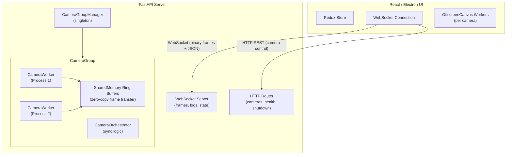
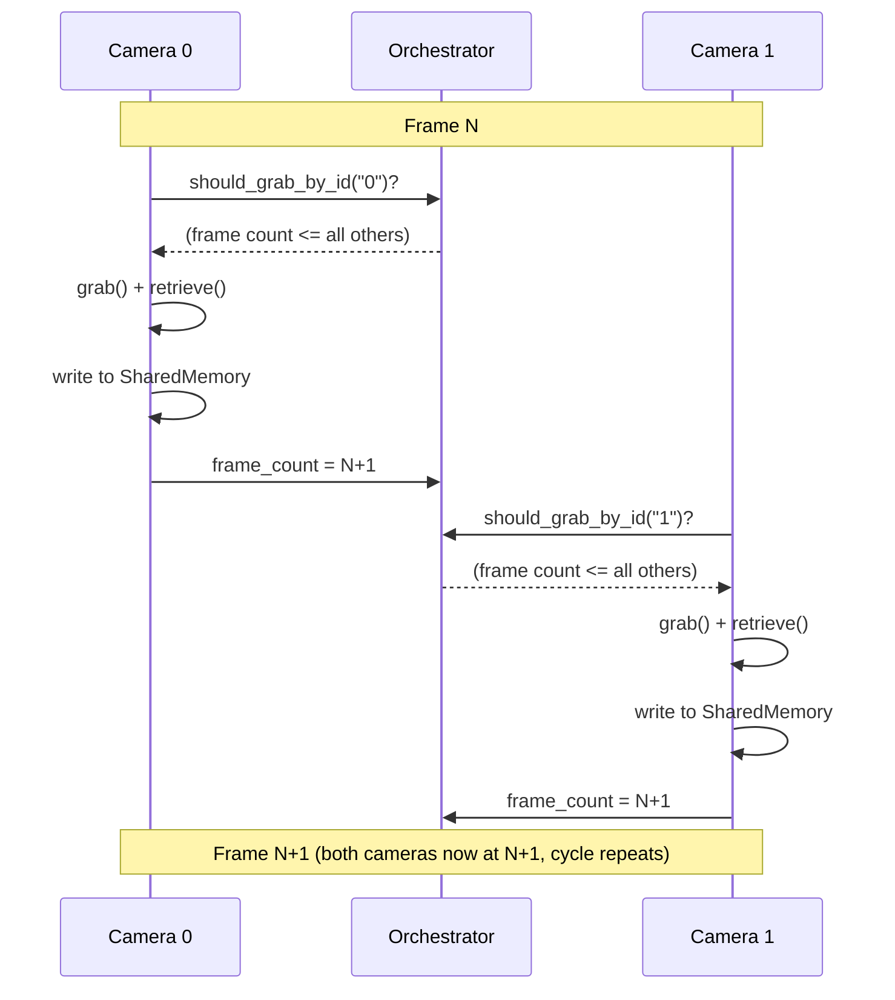

import { AiGeneratedBanner } from '@freemocap/skellydocs';

<AiGeneratedBanner />

# البنية

## نظرة عامة على النظام

SkellyCam هو تطبيق خادم-عميل يتكون من مكونين رئيسيين:

1. **خادم Python** (`skellycam/`) — خادم FastAPI/Uvicorn يدير الكاميرات، ويلتقط الإطارات، ويسجل الفيديو، ويبث البيانات عبر WebSocket.
2. **واجهة React/Electron** (`skellycam-ui/`) — واجهة أمامية تعرض بث الكاميرات المباشر، وتوفر أدوات التحكم في الإعدادات، وتدير التسجيلات.

## نموذج العمليات

يستخدم SkellyCam وحدة `multiprocessing` في Python لتشغيل كل كاميرا في عملية خاصة بها. هذا يتجنب قفل GIL ويضمن أن الكاميرات البطيئة لا تعيق الكاميرات السريعة. المزامنة المثالية للإطارات هي الهدف التصميمي الأساسي للنظام — كل قرار معماري يخدم هذا الهدف.

### العملية الرئيسية

تشغّل العملية الرئيسية خادم FastAPI/Uvicorn وتدير:

- **WorkerRegistry** — يتتبع جميع عمليات العمال المُنشأة ويوفر آلية نبض القلب لمراقبة الصحة.
- **CameraGroupManager** — مفرد يُنشئ/يُدمّر مجموعات الكاميرات ويوجّه استدعاءات API إلى المجموعة الصحيحة.
- **خادم WebSocket** — يرسل حمولات ثنائية متزامنة متعددة الإطارات (صورة واحدة لكل كاميرا لكل حدث إطار) ورسائل JSON (السجلات، الحالة، تحديثات معدل الإطارات) إلى العملاء المتصلين.

### عمليات عمال الكاميرا

تحصل كل كاميرا على `CameraWorker` خاص بها يعمل في `multiprocessing.Process` منفصل:

1. **حلقة التقاط OpenCV** — تستدعي `cv2.VideoCapture.grab()` و `.retrieve()` في بروتوكول منسق من مرحلتين، تلتقط الإطارات بأقصى سرعة تسمح بها الكاميرا.
2. **بيانات الإطار الوصفية** — يتم تعليق كل إطار بطوابع زمنية عالية الدقة `perf_counter_ns` في مراحل متعددة من دورة الحياة (قبل الالتقاط، بعد الالتقاط، قبل الاسترجاع، بعد الاسترجاع، قبل/بعد النسخ إلى الذاكرة المشتركة، قبل/بعد التسجيل).
3. **الكتابة في الذاكرة المشتركة** — تُكتب بيانات الإطار الخام إلى مخزن حلقي في الذاكرة المشتركة، مما يجعلها متاحة للعملية الرئيسية دون نسخ.

### مزامنة الإطارات — البروتوكول الأساسي

يفرض `CameraOrchestrator` مزامنة مثالية للإطارات من خلال بروتوكول **التقاط مبوّب بعدد الإطارات**. تشغّل كل كاميرا حلقة التقاط مستقلة خاصة بها، لكن المنسق يتحكم في متى يُسمح لكل كاميرا بالتقاط إطارها التالي:

1. **فحص البوابة** — قبل كل التقاط، تستدعي الكاميرا `should_grab_by_id()` على المنسق. تُرجع `True` فقط عندما يكون عدد إطارات الكاميرا هو الأدنى (أو مساويًا للأدنى) بين جميع الكاميرات في المجموعة. إذا كانت أي كاميرا أخرى متأخرة، تنتظر الكاميرا الطالبة بنشاط (تستطلع كل 10 ميكروثانية) حتى تلحق الكاميرا المتأخرة.
2. **الالتقاط** — بمجرد فتح البوابة، تستدعي الكاميرا `cv2.VideoCapture.grab()`، الذي يُثبّت صورة المستشعر في مخزن المشغّل المؤقت دون نقل بيانات البكسل. لأن `grab()` سريع، وجميع الكاميرات مبوّبة للتقدم بنفس عدد الإطارات تقريبًا، فإن الفارق الزمني بين الكاميرات يكون ضئيلًا.
3. **الاسترجاع** — تستدعي الكاميرا `cv2.VideoCapture.retrieve()` لفك ترميز الإطار المُثبّت إلى مصفوفة numpy مكتوبة في recarray مخصص مسبقًا.
4. **الكتابة في الذاكرة المشتركة** — تُكتب بيانات الإطار إلى المخزن الحلقي للذاكرة المشتركة الخاص بالكاميرا.
5. **زيادة عدد الإطارات** — يتم تحديث عدد إطارات حالة الكاميرا، مما قد يفتح البوابة أمام كاميرات أخرى تنتظر المتابعة.

يضمن هذا التبويب الموزع أن لا تتقدم أي كاميرا أبدًا بأكثر من إطار واحد عن الأخرى، مما يحافظ على تقدم متزامن دون الحاجة إلى حاجز مركزي صريح.

النتيجة: المستهلكون (بث WebSocket، مسجل الفيديو، الواجهة الأمامية) يرون دائمًا إطارًا واحدًا بالضبط لكل كاميرا لكل حدث، وجميع الإطارات ضمن الحدث تشترك في نفس رقم الإطار. مقاطع الفيديو المسجلة مضمونة أن يكون لها نفس عدد الإطارات.

**أثناء التسجيل**، يعمل `cv2.VideoWriter` لكل كاميرا في عملية الكاميرا الخاصة بها، ويكتب الإطارات بالترتيب الذي تم التقاطها به. يتتبع المنسق `first_recording_frame_number` و `last_recording_frame_number` كأعداد صحيحة مشتركة `multiprocessing.Value`. تتحقق كل كاميرا من هذه القيم مقابل رقم إطارها الحالي لتقرر ما إذا كانت ستسجل أو تنهي. لأن جميع الكاميرات تتقدم بتزامن، يبدأ التسجيل ويتوقف عند نفس حدود الإطار، ومقاطع الفيديو الناتجة مضمونة أن يكون لها أعداد إطارات متطابقة.

**أثناء التشغيل**، تستخدم الواجهة الأمامية استراتيجية مزامنة قائمة على القائد. يتم انتخاب عنصر الفيديو الأول كـ"قائد" ويشغّل عبر `.play()` الأصلي للمتصفح للحصول على عرض سلس بفك ترميز العتاد. تقرأ حلقة `requestAnimationFrame` قيمة `leader.currentTime` لاشتقاق رقم الإطار المعتمد (الوقت × معدل الإطارات). يتم تصحيح انحراف مقاطع الفيديو التابعة فقط عندما تنحرف بأكثر من إطارين، لتجنب عمليات التقديم غير الضرورية التي تسبب تقطعًا. عند الإيقاف المؤقت أو التقدم إطارًا بإطار، يتم تعيين `currentTime` لجميع عناصر `<video>` مباشرة وفي نفس الوقت. يتم تحديث تراكبات الإطارات عبر مراجع DOM مباشرة لتجنب إعادة عرض React أثناء التشغيل.

## تدفق البيانات: من الالتقاط إلى العرض

1. **الكاميرا -> الذاكرة المشتركة** — يكتب كل عامل كاميرا إطاره في مخزن حلقي للذاكرة المشتركة خاص بالكاميرا.
2. **الذاكرة المشتركة -> مخزن الإطارات المتعددة** — تقرأ مجموعة الكاميرات الإطارات من جميع الكاميرات وتكتب إطارًا متعددًا متزامنًا إلى مخزن ذاكرة مشتركة ثانٍ.
3. **الإطارات المتعددة -> WebSocket** — يقرأ خادم WebSocket آخر إطار متعدد، ويضغط صورة كل كاميرا بتنسيق JPEG (جودة 80، مع تغيير الحجم لمطابقة أبعاد عرض العميل أو 50% من الدقة الأصلية)، ويحزمها في حمولة ثنائية.
4. **WebSocket -> الواجهة الأمامية** — تُرسل الحمولة الثنائية عبر WebSocket. تحلل الواجهة الأمامية البروتوكول الثنائي، وتنشئ كائنات `ImageBitmap`، وتعرض على `OffscreenCanvas` عبر Web Workers.

## تدفق البيانات: التسجيل

عندما يكون التسجيل نشطًا:

1. يكتب كل عامل كاميرا الإطارات مباشرة إلى `cv2.VideoWriter` في عمليته الخاصة، مبوّبًا بفحوصات `should_record_frame_number()` مقابل حدود إطارات التسجيل المشتركة للمنسق.
2. يتم تجميع الطوابع الزمنية لكل إطار في الذاكرة وتفريغها إلى CSV عند توقف التسجيل.
3. بعد اكتمال التسجيل، يعالج `RecordingFinalizer` بيانات الطوابع الزمنية، ويحسب إحصائيات المزامنة بين الكاميرات، ويحفظ تقارير ملخصة.

## آليات الاتصال بين العمليات

### المخازن الحلقية للذاكرة المشتركة

يتم نقل بيانات الإطارات بين العمليات باستخدام `multiprocessing.shared_memory.SharedMemory`. تسمح المخازن الحلقية للمنتج (عامل الكاميرا) والمستهلك (العملية الرئيسية) بالعمل بشكل مستقل دون حجب.

### PubSub

نظام نشر/اشتراك خفيف مبني على `multiprocessing.Queue` يُستخدم للبيانات غير المتعلقة بالإطارات مثل تحديثات معدل الإطارات، ومعلومات التسجيل، وتغييرات إعدادات الكاميرا.

### علم الإيقاف العام

`multiprocessing.Value("b", False)` مشترك عبر جميع العمليات. عند تعيينه إلى `True`، تبدأ جميع عمال الكاميرا والخادم في الإغلاق التدريجي.

## بنية الواجهة الأمامية

تستخدم واجهة React:

- **Redux Toolkit** — إدارة الحالة العامة للكاميرات، التسجيل، بيانات معدل الإطارات، السجلات، والسمة.
- **اتصال WebSocket** — اتصال مستمر بالخادم مع إعادة اتصال تلقائية ونبض قلب.
- **FrameProcessor** — يحلل بروتوكول الإطارات المتعددة الثنائي وينشئ كائنات `ImageBitmap`.
- **CanvasManager** — يدير أزواج `OffscreenCanvas` + `Worker` لكل كاميرا، مما يتيح العرض المُسرّع بالعتاد دون حجب الخيط الرئيسي.
- **تشغيل مقفل بالإطارات قائم على القائد** — تنتخب صفحة التشغيل الفيديو الأول كـ"قائد" تقود `.play()` الأصلية الوقت المعتمد. تقرأ حلقة `requestAnimationFrame` قيمة `leader.currentTime` وتشتق رقم الإطار. يتم تصحيح انحراف مقاطع الفيديو التابعة فقط عندما تنحرف بأكثر من إطارين. عند الإيقاف المؤقت أو التقدم إطارًا بإطار، يتم تعيين `video.currentTime` مباشرة على جميع العناصر في نفس الوقت. يتم تحديث تراكبات الإطارات عبر مراجع DOM مباشرة لتجنب إعادة عرض React أثناء التشغيل.
- **Material UI** — مكتبة مكونات لألواح التحكم، وعروض الشجرة، والتخطيط.
- **i18next** — تدويل مع ملفات ترجمة يحافظ عليها المجتمع.
