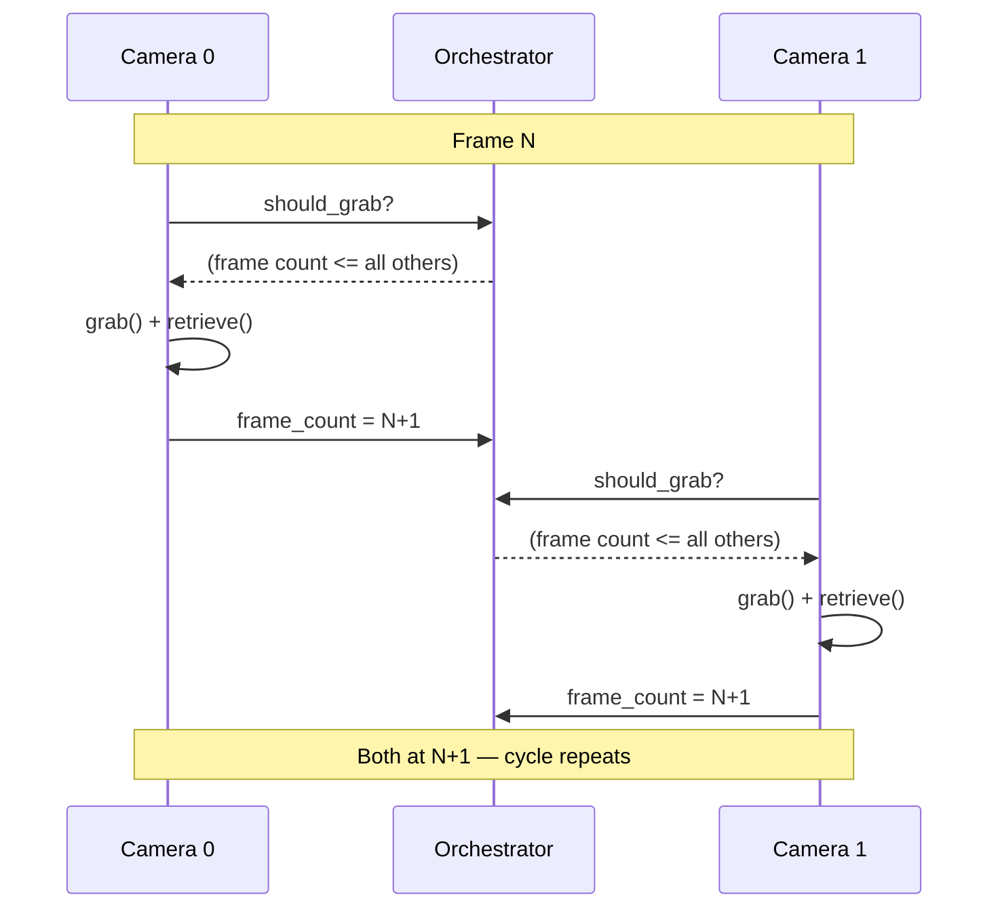

import { AiGeneratedBanner, CoreFeatureHeader } from '@freemocap/skellydocs';
import config from '@site/content.config';

<AiGeneratedBanner />

<CoreFeatureHeader feature={config.features.find(f => f.id === 'frame-perfect-sync')} repoUrl="https://github.com/freemocap/skellycam" />

## المشكلة

تعاني معظم إعدادات الكاميرات المتعددة من **الانحراف بين الكاميرات**. كل كاميرا USB لها ساعتها الداخلية الخاصة وتسلم الإطارات بوتيرتها الخاصة. قد تنتج الكاميرا A بمعدل 30.01 إطار في الثانية بينما تعمل الكاميرا B بمعدل 29.97 إطار في الثانية. خلال تسجيل مدته 10 دقائق، يتراكم هذا الفرق الصغير — تصبح الكاميرات متباعدة بعشرات الإطارات، و"الإطار 1000" من الكاميرا A لم يعد يتوافق مع نفس اللحظة كـ "الإطار 1000" من الكاميرا B.

هذا يجعل المعالجة اللاحقة (التثليث، إعادة البناء ثلاثي الأبعاد، التقاط الحركة) غير موثوقة أو مستحيلة بدون محاذاة معقدة بعد الحقيقة.

## كيف يحل SkellyCam هذه المشكلة

يستخدم SkellyCam **بروتوكول التقاط مُبوب بعدد الإطارات**. كل كاميرا تعمل في عمليتها الخاصة مع حلقة التقاط خاصة بها، لكن `CameraOrchestrator` المشترك يتحكم في متى يُسمح لكل كاميرا بالتقاط إطارها التالي:

1. **فحص البوابة** — قبل كل التقاط، تسأل الكاميرا المنسق: "هل يمكنني المتابعة؟" الجواب هو **نعم** فقط عندما يكون عدد إطارات تلك الكاميرا هو الأقل (أو متساوياً مع الأقل) بين جميع الكاميرات في المجموعة.

2. **الالتقاط** — بمجرد فتح البوابة، تستدعي الكاميرا `grab()` من OpenCV، الذي يثبت صورة المستشعر في مخزن المشغل دون نقل بيانات البكسل. نظراً لأن `grab()` سريع وجميع الكاميرات مُبوبة على نفس عدد الإطارات، فإن الانتشار الزمني عبر الكاميرات يكون ضئيلاً.

3. **الاسترجاع** — تستدعي الكاميرا `retrieve()` لفك تشفير الإطار المثبت إلى مصفوفة numpy.

4. **الزيادة** — يتم تحديث عدد إطارات الكاميرا، مما قد يفتح البوابة للكاميرات الأخرى المنتظرة للمتابعة.

الفكرة الجوهرية: لا تتقدم أي كاميرا أبداً بأكثر من **إطار واحد** عن أي كاميرا أخرى. هذا يحافظ على التقدم المتزامن دون الحاجة إلى حاجز مركزي صريح.

## أثناء التسجيل

يعمل `cv2.VideoWriter` لكل كاميرا في عملية الكاميرا الخاصة بها. يتتبع المنسق قيم `first_recording_frame_number` و`last_recording_frame_number` المشتركة. نظراً لأن جميع الكاميرات تتقدم بخطوة متزامنة، يبدأ التسجيل وينتهي عند نفس حدود الإطار، ومقاطع الفيديو الناتجة **مضمونة أن يكون لها أعداد إطارات متطابقة**.

## ماذا يعني هذا لك

إذا كنت تبني على SkellyCam — سواء لالتقاط الحركة، أو الرؤية المجسمة متعددة الزوايا، أو أي تطبيق كاميرات متعددة آخر — يمكنك التعامل مع فهرس الإطار كمعرف زمني موثوق عبر جميع الكاميرات. الإطار 500 من الكاميرا A والإطار 500 من الكاميرا B تم التقاطهما في نفس اللحظة تقريباً. لا حاجة لخطوة محاذاة.
