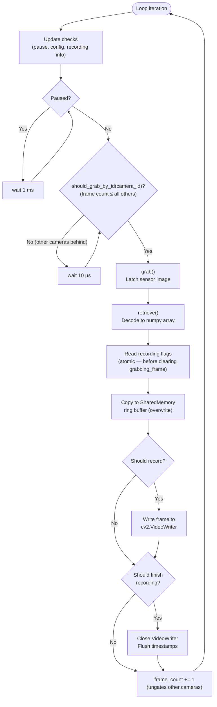
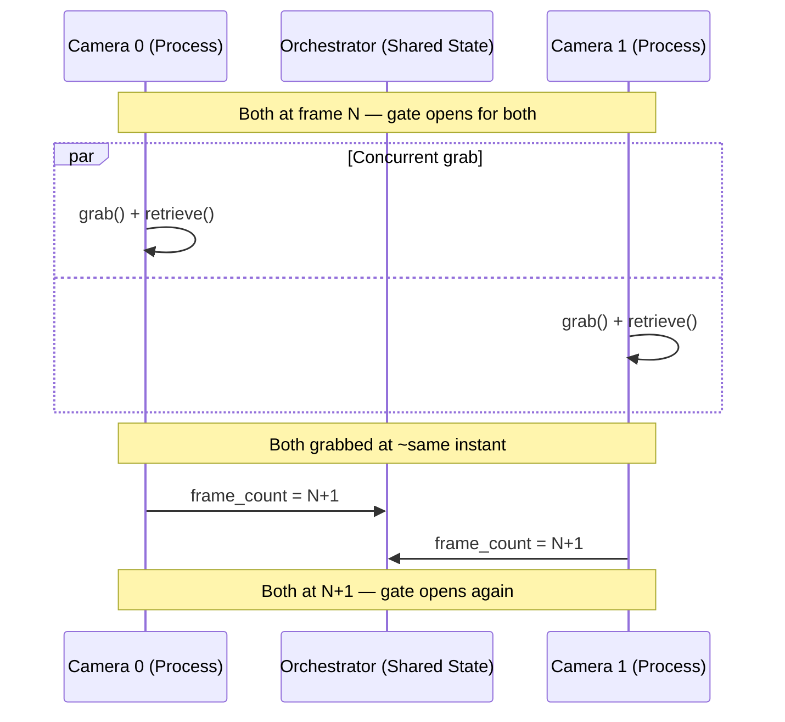

import { AiGeneratedBanner, Tip } from '@freemocap/skellydocs';

<AiGeneratedBanner humanCurated />

# طريقة تزامن الإطارات

هالصفحة غوص تقني عميق ببروتوكول الالتقاط المبوّب بعدد الإطارات تبع SkellyCam. لنظرة عامة أعلى مستوى، شوف [تزامن مثالي للإطارات](/docs/core/frame-perfect-sync).

نظام تزامن الإطارات بالكامل هو <Tip shortInfo="عمليات وين أي تأخير بيأثر مباشرة على الدقة الزمنية." longInfo="SkellyCam بيصنّف العمليات لحلقات ساخنة (التقاط حرج زمنياً)، حلقات صلبة (معالجة حرجة الصحة)، وحلقات مرنة (واجهة مستخدم/بث بأفضل جهد)." href="/docs/technical/architecture#hot-hard-and-soft-loops">**حلقة ساخنة**</Tip> — كل عملية بدورة الالتقاط حرجة زمنياً، وأي تأخير بيأثر مباشرة على الدقة الزمنية.

## حلقة الالتقاط

كل كاميرا بتشغّل الحلقة التالية بعمليتها الخاصة من `multiprocessing.Process`. الحلقة بتشتغل باستمرار من لحظة توصيل الكاميرات لحد ما تنطفي.

:::info شو يعني "ذري" هون
بهالسياق، "ذري" يعني إنو أعلام التسجيل بتنقرأ كعملية واحدة غير قابلة للتجزئة نسبة لدورة الإطار. قيم الأعلام ما فيها تتغير بين قراءتها والتصرف بناءً عليها، لأنو علم `grabbing_frame` ما بينمسح إلا بعد ما تنقرأ الأعلام. هاد بيمنع حالات السباق عند حدود بدء/إيقاف التسجيل وأخطاء الواحد بعدد إطارات الفيديوهات الناتجة.
:::



### خطوة بخطوة

| الخطوة | العملية | موقع الكود | ملاحظات |
|------|-----------|---------------|-------|
| 1 | **فحوصات التحديث** | `camera_loop_update_checks.py` | بتفحص أوامر الإيقاف المؤقت، تحديثات الإعدادات، ومعلومات التسجيل الجديدة |
| 2 | **بوابة الإيقاف المؤقت** | `opencv_camera_loop.py:66-68` | إذا `is_paused`، انتظار دوّار 1 ملي ثانية وتخطي للتكرار التالي |
| 3 | **بوابة التزامن** | `camera_orchestrator.py:93-106` | `should_grab_by_id()` بترجع `True` بس لما عدد إطارات هالكاميرا يكون ≤ كل الكاميرات التانية |
| 4 | **الالتقاط** | `opencv_get_frame.py` | `cv2.VideoCapture.grab()` — بتثبّت صورة المستشعر بذاكرة التخزين المؤقت للسائق |
| 5 | **الاسترجاع** | `opencv_get_frame.py` | `cv2.VideoCapture.retrieve()` — بتفك تشفير الإطار لمصفوفة numpy مخصصة مسبقاً |
| 6 | **أعلام التسجيل** | `opencv_camera_loop.py:90-94` | قراءة الأعلام **قبل** مسح `grabbing_frame` لمنع حالات السباق |
| 7 | **الذاكرة المشتركة** | `camera_shared_memory_ring_buffer.py` | `put_frame(overwrite=True)` — مستهلكو البث ما فيهم يحظروا الالتقاط |
| 8 | **التسجيل** | `handle_video_recording_loop.py` | الكتابة لـ `cv2.VideoWriter` إذا `should_record_frame` مفعّل |
| 9 | **الإنهاء** | `handle_video_recording_loop.py` | إغلاق الكاتب والتفريغ إذا `should_finish_recording` مفعّل |
| 10 | **الزيادة** | `opencv_camera_loop.py` | تحديث `frame_count`، فتح البوابة للكاميرات التانية |

## بوابة التزامن

الـ `CameraOrchestrator` بيفرض تزامن على مستوى الإطار عبر `should_grab_by_id()`:

```python
def should_grab_by_id(self, camera_id) -> bool:
    if not self.all_ready:
        return False
    return self._all_camera_counts_greater_than_or_equal_to_camera(camera_id)
```

الكاميرا فيها تلتقط إطارها التالي بس لما يكون عدد إطاراتها هو **الأقل** (أو متعادل بالأقل) بين كل الكاميرات. هاد بيضمن ما في كاميرا بتسبق كاميرا تانية بأكتر من إطار واحد.

كل الكاميرات بتستطلع هالبوابة بنفس الوقت — لما يوصلوا كلهم لنفس عدد الإطارات، كلهم بيعدّوا البوابة تقريباً بنفس الوقت وبيلتقطوا إطاراتهم التالية بتقارب زمني.



## حدود التسجيل

بدء وإيقاف التسجيل بيتنسقوا عبر كل الكاميرات من خلال أعداد صحيحة مشتركة من `multiprocessing.Value` بيديرها المنسّق:

- `first_recording_frame_number` — بيتحط لما يبدأ تسجيل. قيمته الأولية `-1`.
- `last_recording_frame_number` — بيتحط لما يوقف تسجيل. قيمته الأولية `-1`.

كل كاميرا بتفحص هالقيم بكل إطار:

```python
def should_record_frame_number(self, frame_number: int) -> tuple[bool, bool]:
    should_record_frame = False
    should_finish_recording = False

    if self.first_recording_frame_number.value != -1:
        if frame_number >= self.first_recording_frame_number.value:
            should_record_frame = True

    if self.last_recording_frame_number.value != -1:
        if frame_number < self.last_recording_frame_number.value:
            should_record_frame = True
        elif frame_number >= self.last_recording_frame_number.value:
            should_record_frame = False
            should_finish_recording = True

    return should_record_frame, should_finish_recording
```

### منع خطأ الواحد

أعلام التسجيل بتنقرأ **مباشرة بعد التقاط الإطار وقبل مسح علم `grabbing_frame`**:

```python
# CRITICAL: Get recording flags BEFORE unsetting 'grabbing_frame'
# to avoid potential race-condition-generating flag setting gaps
(should_record_frame,
 should_finish_recording) = orchestrator.should_record_frame_number(
    frame_number=frame_rec_array.frame_metadata.frame_number[0])

self_status.grabbing_frame.value = False  # Only AFTER reading flags
```

هالترتيب بيمنع حالة سباق وين حد التسجيل ممكن يتغير بين قراءة العلم واستخدامه. لأنو كل الكاميرات ماشية بخطوة واحدة، كلها بتعبر حد التسجيل بنفس رقم الإطار، فبتنتج فيديوهات بعدد إطارات متطابق.

## الإيقاف المؤقت وتحديثات الإعدادات

### الإيقاف المؤقت

الإيقاف المؤقت بيتحكم فيه عبر طرق `pause()` / `unpause()` تبع المنسّق، اللي بتحط `should_pause` على كل الكاميرات وبتستنى لحد ما `is_paused` ينتشر:

```python
if self_status.is_paused.value:
    wait_1ms()
    continue  # Skip frame grab entirely
```

لما تكون متوقفة مؤقتاً، الكاميرات بتستنى بانتظار دوّار بفترات 1 ملي ثانية. هاد سريع كفاية للاستخدام التفاعلي مع استهلاك حد أدنى للمعالج.

### تحديثات الإعدادات

تحديثات الإعدادات (الدقة، التعريض، تغيير الترميز) بتنفحص ببداية كل تكرار للحلقة:

```python
if not update_camera_settings_subscription.empty():
    self_status.updating.value = True
    extracted_config = apply_camera_configuration(cv2_video_capture, new_config)
    self_status.updating.value = False
```

بينما كاميرا عم تحدّث (`updating.value = True`)، خاصية `all_ready` تبع المنسّق بترجع `False`، اللي بتمنع كل الكاميرات من الالتقاط. هاد بيضمن إنو تغييرات الإعدادات ما بتصير بنص دورة الإطار.

## أعلام حالة الكاميرا

كل كاميرا بتحافظ على مجموعة أعلام بوليانية من `multiprocessing.Value` للتنسيق بين العمليات:

| العلم | الغرض |
|------|---------|
| `connected` | عتاد الكاميرا تهيّأ وجاهز |
| `grabbing_frame` | حالياً جوا دورة الالتقاط/الاسترجاع |
| `recording_in_progress` | مسجّل الفيديو نشط |
| `is_recording_frame` | حالياً عم يكتب إطار على القرص |
| `is_paused` | متوقف مؤقتاً (ما عم يلتقط) |
| `should_pause` | تم استلام أمر الإيقاف المؤقت |
| `updating` | تحديث الإعدادات قيد التنفيذ |
| `frame_count` | آخر رقم إطار تم التقاطه (`multiprocessing.Value('q')`) |
| `error` / `closing` / `closed` | حالات الخطأ والإغلاق |

خاصية `ready` بتبوّب المنسّق:

```python
@property
def ready(self) -> bool:
    return all([self.connected,
                not self.should_pause,
                not self.should_close,
                not self.closing,
                not self.closed,
                not self.updating,
                not self.error])
```

## حاجز التهيئة

قبل ما تبدأ الحلقة الرئيسية، كل الكاميرات لازم تكمّل التهيئة:

1. الاتصال بالعتاد ونشر الإعدادات المستخرجة
2. الانتظار لإعداد الذاكرة المشتركة من العملية الرئيسية
3. تعيين `connected = True`
4. الانتظار لحد **كل** الكاميرات تحط `connected = True` (حاجز عبر `orchestrator.all_ready`)
5. تفريغ ذاكرة العتاد المؤقتة بقراءة إطارات وهمية
6. تهيئة مصفوفة الإطار بـ `frame_number = -1`

بس بعدين بتبدأ حلقة الالتقاط المتزامنة — مما بيضمن إنو كل الكاميرات بتبدأ من الإطار 0 مع بعض.

## التعامل مع الأخطاء

إذا أي كاميرا واجهت خطأ:

1. `signal_error()` بتحط `error = True` و `connected = False`
2. `ipc.kill_everything()` بتحط علم القتل العام
3. كتلة `finally` بتضمن إنو أي تسجيل قيد التنفيذ بينتهي (ملف الفيديو بينسكر، الطوابع الزمنية بتتفرّغ)
4. الذاكرة المشتركة للكاميرا بتنسكر والتقاط OpenCV بينحرر

هاد بيضمن إنو حتى بحالات الانهيار، البيانات المسجلة بتنحفظ بأكمل شكل ممكن.
