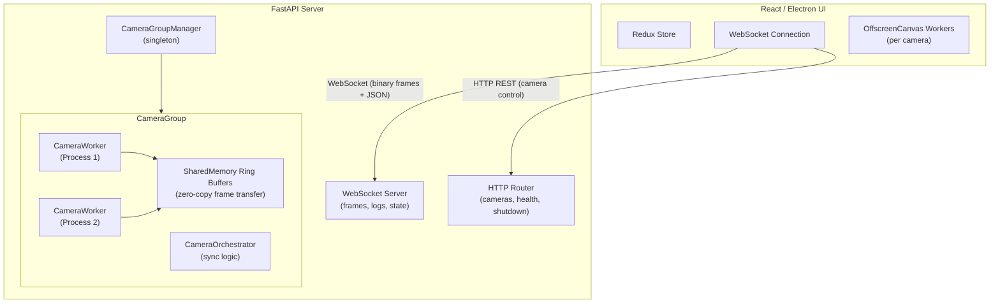
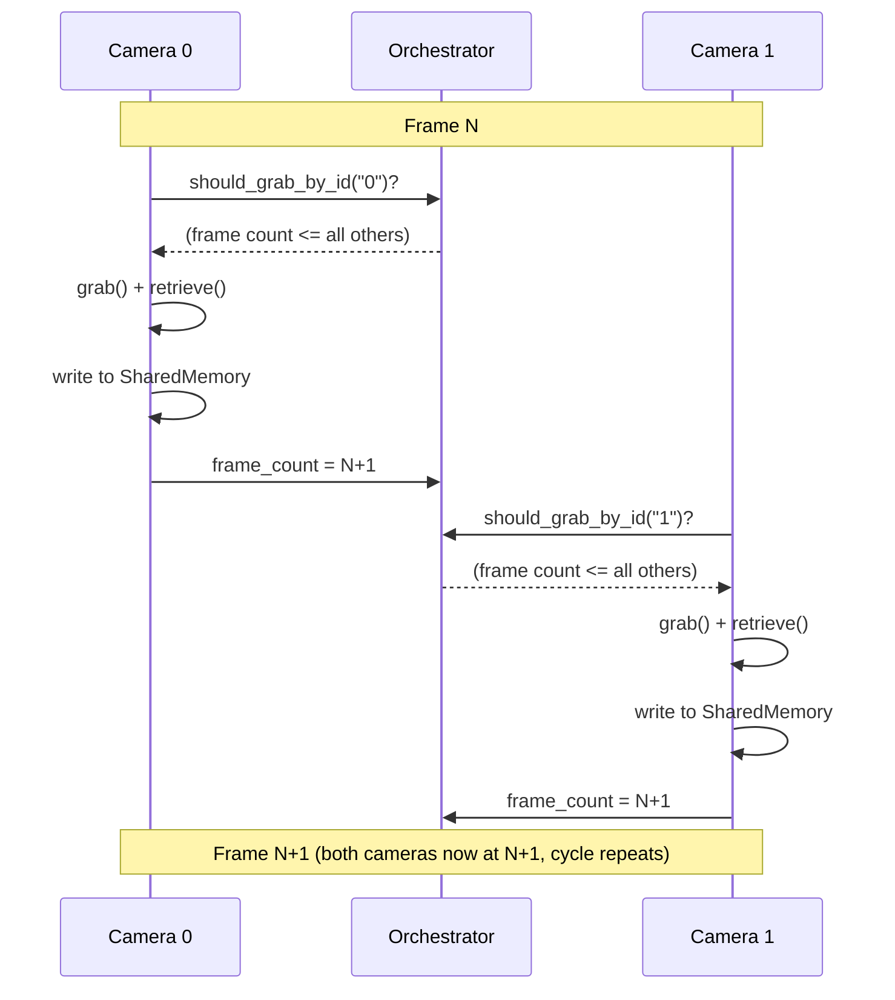
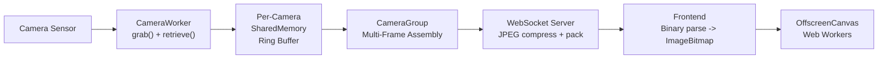

import { AiGeneratedBanner } from '@freemocap/skellydocs';

<AiGeneratedBanner />

# Arquitectura

## Vision General del Sistema

SkellyCam es una aplicacion cliente-servidor con dos componentes principales:

1. **Servidor Python** (`skellycam/`) — Un servidor FastAPI/Uvicorn que gestiona camaras, captura fotogramas, graba video y transmite datos por WebSocket.
2. **Interfaz React/Electron** (`skellycam-ui/`) — Un frontend que muestra las transmisiones de camaras en vivo, proporciona controles de configuracion y gestiona las grabaciones.

## Modelo de Procesos

SkellyCam usa el modulo `multiprocessing` de Python para ejecutar cada camara en su propio proceso. Esto evita el GIL y asegura que las camaras lentas no bloqueen a las rapidas. La sincronizacion perfecta de fotogramas es el objetivo principal de diseno del sistema — cada decision arquitectonica esta al servicio de ello.

### Proceso Principal

El proceso principal ejecuta el servidor FastAPI/Uvicorn y gestiona:

- **WorkerRegistry** — Rastrea todos los procesos worker generados y proporciona un mecanismo de heartbeat para el monitoreo de salud.
- **CameraGroupManager** — Singleton que crea/destruye grupos de camaras y enruta las llamadas API al grupo correcto.
- **Servidor WebSocket** — Envia cargas binarias sincronizadas de multi-fotograma (una imagen por camara por evento de fotograma) y mensajes JSON (logs, estado, actualizaciones de velocidad de fotogramas) a los clientes conectados.

### Procesos Worker de Camara

Cada camara tiene su propio `CameraWorker` ejecutandose en un `multiprocessing.Process` separado:

1. **Bucle de Captura OpenCV** — Llama a `cv2.VideoCapture.grab()` y `.retrieve()` en un protocolo coordinado de dos fases, capturando fotogramas tan rapido como la camara lo permita.
2. **Metadatos del Fotograma** — Cada fotograma se anota con marcas de tiempo `perf_counter_ns` de alta resolucion en multiples etapas del ciclo de vida (pre-grab, post-grab, pre-retrieve, post-retrieve, pre/post copia a memoria compartida, pre/post grabacion).
3. **Escritura en Memoria Compartida** — Los datos crudos del fotograma se escriben en un buffer circular de memoria compartida, haciendolos disponibles para el proceso principal sin necesidad de copia.

### Sincronizacion de Fotogramas — El Protocolo Central

El `CameraOrchestrator` impone la sincronizacion perfecta de fotogramas a traves de un protocolo de **captura controlada por conteo de fotogramas**. Cada camara ejecuta su propio bucle de captura independiente, pero el orquestador controla cuando cada camara puede capturar su siguiente fotograma:

1. **Verificacion de compuerta** — Antes de cada captura, una camara llama a `should_grab_by_id()` en el orquestador. Esto devuelve `True` solo cuando el conteo de fotogramas de la camara es el mas bajo (o empatado como el mas bajo) entre todas las camaras del grupo. Si alguna otra camara esta atrasada, la camara solicitante espera activamente (sondeando cada 10us) hasta que la camara rezagada se ponga al dia.
2. **Grab** — Una vez desbloqueada, la camara llama a `cv2.VideoCapture.grab()`, que captura la imagen del sensor en el buffer del controlador sin transferir datos de pixeles. Debido a que `grab()` es rapido, y todas las camaras estan controladas para proceder aproximadamente con el mismo conteo de fotogramas, la dispersion temporal entre camaras es minima.
3. **Retrieve** — La camara llama a `cv2.VideoCapture.retrieve()` para decodificar el fotograma capturado en un array numpy escrito en un recarray preasignado.
4. **Escritura en memoria compartida** — Los datos del fotograma se escriben en el buffer circular de memoria compartida de la camara.
5. **Incrementar conteo de fotogramas** — El conteo de fotogramas del estado de la camara se actualiza, lo que puede desbloquear a otras camaras en espera.

Este mecanismo de compuerta distribuida asegura que ninguna camara se adelante mas de un fotograma respecto a las demas, manteniendo una progresion sincronizada sin requerir una barrera centralizada explicita.

El resultado: los consumidores (transmision WebSocket, grabador de video, frontend) siempre ven exactamente un fotograma por camara por evento, y todos los fotogramas dentro de un evento comparten el mismo numero de fotograma. Los videos grabados tienen garantizado el mismo conteo de fotogramas.

**Durante la grabacion**, el `cv2.VideoWriter` de cada camara se ejecuta en el propio proceso de la camara, escribiendo fotogramas en el orden en que se capturan. El orquestador rastrea `first_recording_frame_number` y `last_recording_frame_number` como enteros `multiprocessing.Value` compartidos. Cada camara verifica estos contra su numero de fotograma actual para decidir si grabar o finalizar. Debido a que todas las camaras progresan sincronizadamente, la grabacion comienza y termina en el mismo limite de fotograma, y los videos de salida tienen garantizado tener conteos de fotogramas identicos.

**Durante la reproduccion**, el frontend usa una estrategia de sincronizacion basada en lider. El primer elemento de video se elige como el "lider" y se reproduce mediante el `.play()` nativo del navegador para una renderizacion fluida decodificada por hardware. Un bucle `requestAnimationFrame` lee `leader.currentTime` para derivar el numero de fotograma autoritativo (tiempo x fps). Los videos seguidores solo se corrigen cuando divergen mas alla de una tolerancia de 2 fotogramas, evitando busquedas innecesarias que causan tartamudeo. Al pausar o avanzar fotograma a fotograma, todos los elementos `<video>` tienen su `currentTime` establecido directa y simultaneamente. Las superposiciones de fotogramas se actualizan mediante referencias DOM directas para evitar re-renderizados de React durante la reproduccion.

## Flujo de Datos: De la Captura a la Visualizacion

1. **Camara -> Memoria Compartida** — Cada worker de camara escribe su fotograma en un buffer circular de memoria compartida por camara.
2. **Memoria Compartida -> Buffer MultiFrame** — El grupo de camaras lee los fotogramas de todas las camaras y escribe un multi-fotograma sincronizado en un segundo buffer de memoria compartida.
3. **MultiFrame -> WebSocket** — El servidor WebSocket lee el ultimo multi-fotograma, comprime en JPEG la imagen de cada camara (calidad 80, redimensionada para coincidir con las dimensiones de visualizacion del cliente o al 50% de la resolucion nativa), y las empaqueta en una carga binaria.
4. **WebSocket -> Frontend** — La carga binaria se envia por WebSocket. El frontend analiza el protocolo binario, crea objetos `ImageBitmap` y renderiza en `OffscreenCanvas` mediante Web Workers.

## Flujo de Datos: Grabacion

Cuando la grabacion esta activa:

1. Cada worker de camara escribe fotogramas directamente en un `cv2.VideoWriter` en su propio proceso, controlado por verificaciones de `should_record_frame_number()` contra los limites de fotograma de grabacion compartidos del orquestador.
2. Las marcas de tiempo por fotograma se acumulan en memoria y se escriben a CSV cuando la grabacion se detiene.
3. Despues de que la grabacion se completa, el `RecordingFinalizer` procesa los datos de marcas de tiempo, calcula estadisticas de sincronizacion entre camaras y guarda informes resumidos.

## Mecanismos IPC

### Buffers Circulares de Memoria Compartida

Los datos de fotogramas se transfieren entre procesos usando `multiprocessing.shared_memory.SharedMemory`. Los buffers circulares permiten que el productor (worker de camara) y el consumidor (proceso principal) operen de forma independiente sin bloquearse.

### PubSub

Un sistema ligero de publicacion/suscripcion construido sobre `multiprocessing.Queue` se usa para datos que no son fotogramas, como actualizaciones de velocidad de fotogramas, informacion de grabacion y cambios de configuracion de camara.

### Bandera Global de Terminacion

Un `multiprocessing.Value("b", False)` compartido entre todos los procesos. Cuando se establece en `True`, todos los workers de camara y el servidor comienzan un apagado ordenado.

## Arquitectura del Frontend

La interfaz React usa:

- **Redux Toolkit** — Gestion de estado global para camaras, grabacion, datos de velocidad de fotogramas, logs y tema.
- **Conexion WebSocket** — Conexion persistente al servidor con reconexion automatica y heartbeat.
- **FrameProcessor** — Analiza el protocolo binario de multi-fotograma y crea objetos `ImageBitmap`.
- **CanvasManager** — Gestiona pares de `OffscreenCanvas` + `Worker` para cada camara, habilitando renderizado acelerado por GPU sin bloquear el hilo principal.
- **Reproduccion Bloqueada por Fotograma Basada en Lider** — La pagina de reproduccion elige el primer video como el "lider" cuyo `.play()` nativo impulsa el tiempo canonico. Un bucle `requestAnimationFrame` lee `leader.currentTime` y deriva el numero de fotograma. Los videos seguidores solo se corrigen cuando divergen mas de 2 fotogramas. Al pausar o avanzar fotograma a fotograma, `video.currentTime` se establece directamente en todos los elementos simultaneamente. Las superposiciones de fotogramas se actualizan mediante referencias DOM directas para evitar re-renderizados de React durante la reproduccion.
- **Material UI** — Biblioteca de componentes para los paneles de control, vistas de arbol y diseno.
- **i18next** — Internacionalizacion con archivos de traduccion mantenidos por la comunidad.
