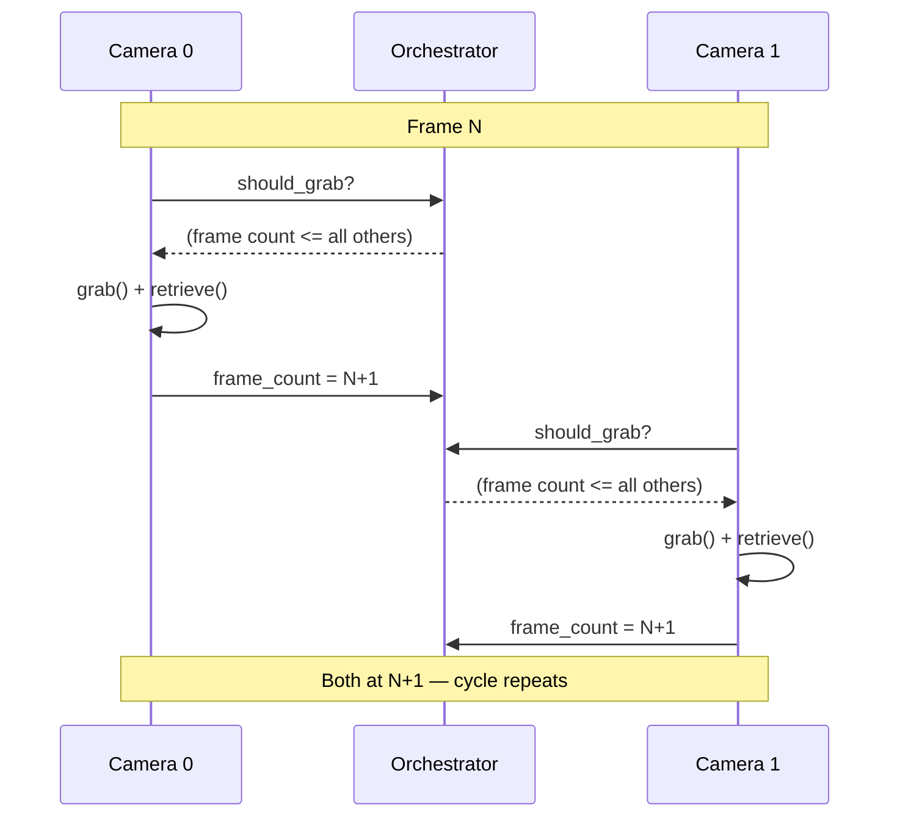

import { AiGeneratedBanner, CoreFeatureHeader } from '@freemocap/skellydocs';
import config from '@site/content.config';

<AiGeneratedBanner />

<CoreFeatureHeader feature={config.features.find(f => f.id === 'frame-perfect-sync')} repoUrl="https://github.com/freemocap/skellycam" />

## El problema

La mayoria de las configuraciones multicamara sufren de **deriva entre camaras**. Cada camara USB tiene su propio reloj interno y entrega fotogramas a su propio ritmo. La camara A puede producir 30.01 fps mientras que la camara B funciona a 29.97 fps. Durante una grabacion de 10 minutos, esa pequena diferencia se acumula — las camaras terminan con decenas de fotogramas de diferencia, y el "fotograma 1000" de la camara A ya no corresponde al mismo momento que el "fotograma 1000" de la camara B.

Esto hace que el procesamiento posterior (triangulacion, reconstruccion 3D, captura de movimiento) sea poco fiable o imposible sin una alineacion compleja posterior.

## Como lo resuelve SkellyCam

SkellyCam usa un **protocolo de captura controlado por conteo de fotogramas**. Cada camara se ejecuta en su propio proceso con su propio bucle de captura, pero un `CameraOrchestrator` compartido controla cuando cada camara puede capturar su siguiente fotograma:

1. **Verificacion de compuerta** — Antes de cada captura, una camara pregunta al orquestador: "puedo continuar?" La respuesta es **si** solo cuando el conteo de fotogramas de esa camara es el mas bajo (o empatado como el mas bajo) entre todas las camaras del grupo.

2. **Grab** — Una vez desbloqueada, la camara llama a `grab()` de OpenCV, que captura la imagen del sensor en el buffer del controlador sin transferir datos de pixeles. Debido a que `grab()` es rapido y todas las camaras estan controladas al mismo conteo de fotogramas, la dispersion temporal entre camaras es minima.

3. **Retrieve** — La camara llama a `retrieve()` para decodificar el fotograma capturado en un array numpy.

4. **Incrementar** — El conteo de fotogramas de la camara se actualiza, lo que puede desbloquear a otras camaras en espera.

La idea clave: ninguna camara se adelanta jamas mas de **un fotograma** respecto a cualquier otra. Esto mantiene una progresion sincronizada sin requerir una barrera centralizada explicita.

## Durante la grabacion

El `cv2.VideoWriter` de cada camara se ejecuta en el propio proceso de la camara. El orquestador rastrea los valores compartidos `first_recording_frame_number` y `last_recording_frame_number`. Debido a que todas las camaras progresan sincronizadamente, la grabacion comienza y termina en el mismo limite de fotograma, y los videos de salida tienen **garantizado tener conteos de fotogramas identicos**.

## Que significa esto para ti

Si estas construyendo sobre SkellyCam — ya sea para captura de movimiento, estereo multi-vista, o cualquier otra aplicacion multicamara — puedes tratar el indice de fotograma como un identificador temporal fiable entre todas las camaras. El fotograma 500 de la camara A y el fotograma 500 de la camara B fueron capturados aproximadamente en el mismo instante. No se necesita ningun paso de alineacion.
