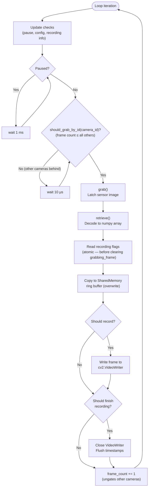
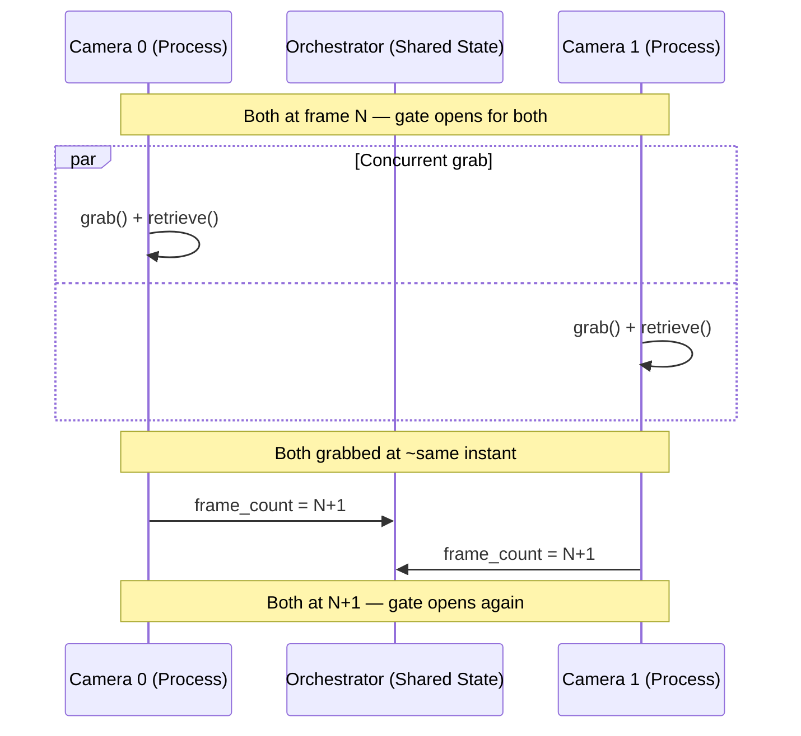

import { AiGeneratedBanner, Tip } from '@freemocap/skellydocs';

<AiGeneratedBanner humanCurated />

# Metodo de Sincronizacion de Fotogramas

Esta pagina es una inmersion tecnica profunda en el protocolo de captura controlado por conteo de fotogramas de SkellyCam. Para una vision general de mas alto nivel, consulta [Sincronizacion Perfecta de Fotogramas](/docs/core/frame-perfect-sync).

Todo el sistema de sincronizacion de fotogramas es un <Tip shortInfo="Operaciones donde cualquier retraso degrada directamente la fidelidad temporal." longInfo="SkellyCam clasifica las operaciones en bucles calientes (captura critica en tiempo), bucles duros (procesamiento critico en correccion) y bucles suaves (UI/streaming de mejor esfuerzo)." href="/docs/technical/architecture#hot-hard-and-soft-loops">**bucle caliente**</Tip> — cada operacion en el ciclo de captura es critica en tiempo, y cualquier retraso afecta directamente la fidelidad temporal.

## El bucle de captura

Cada camara ejecuta el siguiente bucle en su propio `multiprocessing.Process`. El bucle se ejecuta continuamente desde el momento en que las camaras se conectan hasta que se apagan.

:::info Que significa "atomico" aqui
En este contexto, "atomico" significa que las banderas de grabacion se leen como una sola operacion indivisible relativa al ciclo de fotogramas. Los valores de las banderas no pueden cambiar entre leerlos y actuar sobre ellos, porque la bandera `grabbing_frame` no se limpia hasta DESPUES de que se leen las banderas. Esto previene condiciones de carrera en los limites de inicio/parada de grabacion y errores de uno en los conteos de fotogramas de los videos resultantes.
:::



### Paso a paso

| Paso | Operacion | Ubicacion en el codigo | Notas |
|------|-----------|------------------------|-------|
| 1 | **Verificaciones de actualizacion** | `camera_loop_update_checks.py` | Verifica comandos de pausa, actualizaciones de configuracion e informacion de nueva grabacion |
| 2 | **Compuerta de pausa** | `opencv_camera_loop.py:66-68` | Si `is_paused`, espera activa de 1 ms y salta a la siguiente iteracion |
| 3 | **Compuerta de sincronizacion** | `camera_orchestrator.py:93-106` | `should_grab_by_id()` retorna `True` solo cuando el conteo de fotogramas de esta camara es ≤ que el de todas las demas |
| 4 | **Grab** | `opencv_get_frame.py` | `cv2.VideoCapture.grab()` — captura la imagen del sensor en el buffer del driver |
| 5 | **Retrieve** | `opencv_get_frame.py` | `cv2.VideoCapture.retrieve()` — decodifica el fotograma en un recarray numpy preasignado |
| 6 | **Banderas de grabacion** | `opencv_camera_loop.py:90-94` | Lee las banderas **antes** de limpiar `grabbing_frame` para prevenir condiciones de carrera |
| 7 | **Memoria compartida** | `camera_shared_memory_ring_buffer.py` | `put_frame(overwrite=True)` — los consumidores de streaming no pueden bloquear la captura |
| 8 | **Grabar** | `handle_video_recording_loop.py` | Escribe en `cv2.VideoWriter` si `should_record_frame` esta activado |
| 9 | **Finalizar** | `handle_video_recording_loop.py` | Cierra el writer y vacia si `should_finish_recording` esta activado |
| 10 | **Incrementar** | `opencv_camera_loop.py` | Actualiza `frame_count`, desbloqueando las otras camaras |

## La compuerta de sincronizacion

El `CameraOrchestrator` impone la sincronizacion a nivel de fotograma mediante `should_grab_by_id()`:

```python
def should_grab_by_id(self, camera_id) -> bool:
    if not self.all_ready:
        return False
    return self._all_camera_counts_greater_than_or_equal_to_camera(camera_id)
```

Una camara solo puede capturar su siguiente fotograma cuando su conteo de fotogramas es el **mas bajo** (o empatado en el mas bajo) entre todas las camaras. Esto asegura que ninguna camara se adelante mas de un fotograma respecto a cualquier otra.

Todas las camaras consultan esta compuerta de forma concurrente — cuando todas alcanzan el mismo conteo de fotogramas, todas pasan la compuerta aproximadamente al mismo tiempo y capturan sus siguientes fotogramas en proximidad temporal cercana.



## Limites de grabacion

El inicio y la parada de grabacion se coordinan entre todas las camaras a traves de enteros `multiprocessing.Value` compartidos gestionados por el orquestador:

- `first_recording_frame_number` — Se establece cuando comienza una grabacion. Inicialmente `-1`.
- `last_recording_frame_number` — Se establece cuando se detiene una grabacion. Inicialmente `-1`.

Cada camara verifica estos valores en cada fotograma:

```python
def should_record_frame_number(self, frame_number: int) -> tuple[bool, bool]:
    should_record_frame = False
    should_finish_recording = False

    if self.first_recording_frame_number.value != -1:
        if frame_number >= self.first_recording_frame_number.value:
            should_record_frame = True

    if self.last_recording_frame_number.value != -1:
        if frame_number < self.last_recording_frame_number.value:
            should_record_frame = True
        elif frame_number >= self.last_recording_frame_number.value:
            should_record_frame = False
            should_finish_recording = True

    return should_record_frame, should_finish_recording
```

### Prevencion de errores de uno

Las banderas de grabacion se leen **inmediatamente despues de la captura del fotograma y antes de que se limpie la bandera `grabbing_frame`**:

```python
# CRITICAL: Get recording flags BEFORE unsetting 'grabbing_frame'
# to avoid potential race-condition-generating flag setting gaps
(should_record_frame,
 should_finish_recording) = orchestrator.should_record_frame_number(
    frame_number=frame_rec_array.frame_metadata.frame_number[0])

self_status.grabbing_frame.value = False  # Only AFTER reading flags
```

Este ordenamiento previene una condicion de carrera donde el limite de grabacion podria cambiar entre leer la bandera y usarla. Dado que todas las camaras estan en sincronizacion paso a paso, todas cruzan el limite de grabacion en el mismo numero de fotograma, produciendo videos con conteos de fotogramas identicos.

## Pausa y actualizaciones de configuracion

### Pausa

La pausa es controlada por los metodos `pause()` / `unpause()` del orquestador, que establecen `should_pause` en todas las camaras y esperan a que `is_paused` se propague:

```python
if self_status.is_paused.value:
    wait_1ms()
    continue  # Skip frame grab entirely
```

Cuando estan pausadas, las camaras hacen espera activa en intervalos de 1 ms. Esto es suficientemente responsivo para uso interactivo mientras consume CPU minimo.

### Actualizaciones de configuracion

Las actualizaciones de configuracion (cambios de resolucion, exposicion, codec) se verifican al inicio de cada iteracion del bucle:

```python
if not update_camera_settings_subscription.empty():
    self_status.updating.value = True
    extracted_config = apply_camera_configuration(cv2_video_capture, new_config)
    self_status.updating.value = False
```

Mientras una camara se esta actualizando (`updating.value = True`), la propiedad `all_ready` del orquestador retorna `False`, lo que previene que todas las camaras capturen. Esto asegura que los cambios de configuracion no ocurran a mitad del ciclo de fotogramas.

## Banderas de estado de camara

Cada camara mantiene un conjunto de banderas booleanas `multiprocessing.Value` para la coordinacion entre procesos:

| Bandera | Proposito |
|---------|-----------|
| `connected` | Hardware de camara inicializado y listo |
| `grabbing_frame` | Actualmente dentro del ciclo grab/retrieve |
| `recording_in_progress` | VideoRecorder esta activo |
| `is_recording_frame` | Actualmente escribiendo un fotograma a disco |
| `is_paused` | Pausado (no capturando) |
| `should_pause` | Comando de pausa recibido |
| `updating` | Actualizacion de configuracion en progreso |
| `frame_count` | Ultimo numero de fotograma capturado (`multiprocessing.Value('q')`) |
| `error` / `closing` / `closed` | Estados de error y apagado |

La propiedad `ready` controla el orquestador:

```python
@property
def ready(self) -> bool:
    return all([self.connected,
                not self.should_pause,
                not self.should_close,
                not self.closing,
                not self.closed,
                not self.updating,
                not self.error])
```

## Barrera de inicializacion

Antes de que comience el bucle principal, todas las camaras deben completar la inicializacion:

1. Conectar al hardware y publicar la configuracion extraida
2. Esperar la configuracion de memoria compartida del proceso principal
3. Establecer `connected = True`
4. Esperar a que **todas** las camaras establezcan `connected = True` (barrera via `orchestrator.all_ready`)
5. Limpiar el buffer de hardware leyendo fotogramas ficticios
6. Inicializar el recarray de fotogramas con `frame_number = -1`

Solo entonces comienza el bucle de captura sincronizada — asegurando que todas las camaras empiecen en el fotograma 0 juntas.

## Manejo de errores

Si alguna camara encuentra un error:

1. `signal_error()` establece `error = True` y `connected = False`
2. `ipc.kill_everything()` activa la bandera global de terminacion
3. El bloque `finally` asegura que cualquier grabacion en progreso se finalice (archivo de video cerrado, marcas de tiempo vaciadas)
4. La memoria compartida de la camara se cierra y la captura OpenCV se libera

Esto asegura que incluso en escenarios de fallo, los datos grabados se preservan lo mas completamente posible.
