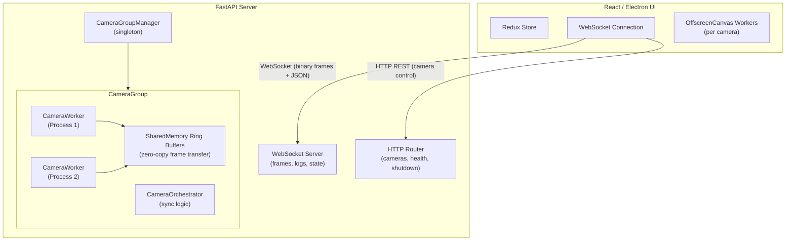
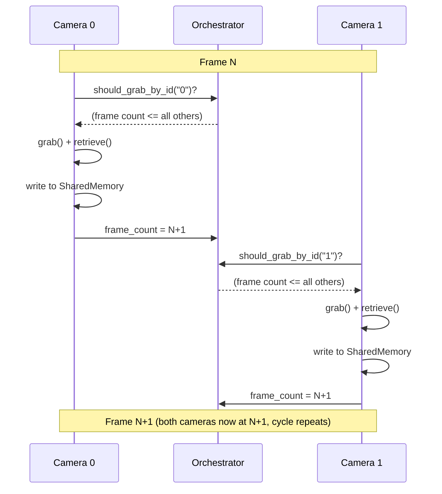
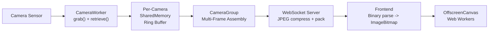

import { AiGeneratedBanner } from '@freemocap/skellydocs';

<AiGeneratedBanner />

# 架构

## 系统概述

SkellyCam 是一个客户端-服务器应用程序，包含两个主要组件：

1. **Python 服务器**（`skellycam/`）— 一个 FastAPI/Uvicorn 服务器，管理摄像头、捕获帧、录制视频并通过 WebSocket 传输数据。
2. **React/Electron UI**（`skellycam-ui/`）— 一个前端，显示实时摄像头画面、提供配置控制并管理录制。

## 进程模型

SkellyCam 使用 Python 的 `multiprocessing` 模块在独立进程中运行每个摄像头。这避免了 GIL 限制，确保慢速摄像头不会阻塞快速摄像头。帧级精确同步是系统的首要设计目标——每个架构决策都服务于此。

### 主进程

主进程运行 FastAPI/Uvicorn 服务器并管理：

- **WorkerRegistry** — 跟踪所有已启动的工作进程，并提供心跳机制进行健康监控。
- **CameraGroupManager** — 单例模式，创建/销毁摄像头组并将 API 调用路由到正确的组。
- **WebSocket 服务器** — 发送同步的多帧二进制负载（每个帧事件中每个摄像头一张图像）和 JSON 消息（日志、状态、帧率更新）给已连接的客户端。

### 摄像头工作进程

每个摄像头都有自己的 `CameraWorker`，运行在独立的 `multiprocessing.Process` 中：

1. **OpenCV 捕获循环** — 在协调的两阶段协议中调用 `cv2.VideoCapture.grab()` 和 `.retrieve()`，以摄像头允许的最快速度抓取帧。
2. **帧元数据** — 每帧都带有高分辨率 `perf_counter_ns` 时间戳，标记在多个生命周期阶段（grab 前、grab 后、retrieve 前、retrieve 后、共享内存复制前/后、录制前/后）。
3. **共享内存写入** — 原始帧数据写入共享内存环形缓冲区，使主进程无需复制即可访问。

### 帧同步——核心协议

`CameraOrchestrator` 通过**帧计数门控捕获**协议实现帧级精确同步。每个摄像头运行自己独立的捕获循环，但协调器控制每个摄像头何时可以抓取下一帧：

1. **门控检查** — 在每次抓取前，摄像头调用协调器的 `should_grab_by_id()`。只有当该摄像头的帧计数是所有摄像头中最低的（或并列最低的）时才返回 `True`。如果有其他摄像头落后，请求的摄像头会忙等待（每 10us 轮询一次），直到落后的摄像头赶上。
2. **抓取** — 一旦通过门控，摄像头调用 `cv2.VideoCapture.grab()`，在驱动缓冲区中锁定传感器图像而不传输像素数据。因为 `grab()` 速度快，且所有摄像头被门控到大致相同的帧计数，摄像头间的时间差异很小。
3. **检索** — 摄像头调用 `cv2.VideoCapture.retrieve()` 将锁定的帧解码为写入预分配 recarray 的 numpy 数组。
4. **写入共享内存** — 帧数据写入摄像头的共享内存环形缓冲区。
5. **递增帧计数** — 摄像头的状态帧计数更新，这可能解除其他等待中的摄像头的门控。

这种分布式门控确保没有摄像头比其他摄像头超前一帧以上，在不需要显式集中屏障的情况下保持锁步推进。

结果是：消费者（WebSocket 流、视频录制器、前端）始终看到每个事件中每个摄像头恰好一帧，且事件内的所有帧共享相同的帧号。录制的视频保证具有相同的帧数。

**录制期间**，每个摄像头的 `cv2.VideoWriter` 在摄像头自己的进程中运行，按捕获顺序写入帧。协调器将 `first_recording_frame_number` 和 `last_recording_frame_number` 作为共享的 `multiprocessing.Value` 整数进行跟踪。每个摄像头根据当前帧号检查这些值以决定是否录制或完成。因为所有摄像头锁步推进，录制在相同的帧边界开始和停止，输出视频保证具有相同的帧数。

**回放期间**，前端使用基于领导者的同步策略。第一个视频元素被选为"领导者"，通过浏览器原生的 `.play()` 播放以实现流畅的硬件解码渲染。`requestAnimationFrame` 循环读取 `leader.currentTime` 以推导权威帧号（时间 x 帧率）。跟随者视频仅在偏差超过 2 帧容差时进行漂移校正，避免不必要的寻址导致卡顿。暂停或逐帧步进时，所有 `<video>` 元素的 `currentTime` 被直接同时设置。帧覆盖层通过直接 DOM 引用更新，避免回放期间的 React 重渲染。

## 数据流：从捕获到显示

1. **摄像头 -> 共享内存** — 每个摄像头工作进程将帧写入各自的共享内存环形缓冲区。
2. **共享内存 -> 多帧缓冲区** — 摄像头组从所有摄像头读取帧，并将同步的多帧写入第二个共享内存缓冲区。
3. **多帧 -> WebSocket** — WebSocket 服务器读取最新的多帧，对每个摄像头图像进行 JPEG 压缩（质量 80，调整大小以匹配客户端显示尺寸或原始分辨率的 50%），并打包成二进制负载。
4. **WebSocket -> 前端** — 二进制负载通过 WebSocket 发送。前端解析二进制协议，创建 `ImageBitmap` 对象，并通过 Web Workers 渲染到 `OffscreenCanvas`。

## 数据流：录制

录制激活时：

1. 每个摄像头工作进程在自己的进程中直接将帧写入 `cv2.VideoWriter`，通过 `should_record_frame_number()` 检查协调器的共享录制帧边界进行门控。
2. 逐帧时间戳在内存中累积，录制停止时写入 CSV。
3. 录制完成后，`RecordingFinalizer` 处理时间戳数据，计算摄像头间同步统计信息，并保存摘要报告。

## IPC 机制

### 共享内存环形缓冲区

帧数据使用 `multiprocessing.shared_memory.SharedMemory` 在进程间传输。环形缓冲区允许生产者（摄像头工作进程）和消费者（主进程）独立操作而不阻塞。

### 发布/订阅

基于 `multiprocessing.Queue` 构建的轻量级发布/订阅系统，用于传输非帧数据，如帧率更新、录制信息和摄像头设置更改。

### 全局终止标志

一个跨所有进程共享的 `multiprocessing.Value("b", False)`。当设置为 `True` 时，所有摄像头工作进程和服务器开始优雅关闭。

## 前端架构

React UI 使用：

- **Redux Toolkit** — 用于摄像头、录制、帧率数据、日志和主题的全局状态管理。
- **WebSocket 连接** — 与服务器的持久连接，支持自动重连和心跳。
- **FrameProcessor** — 解析二进制多帧协议并创建 `ImageBitmap` 对象。
- **CanvasManager** — 为每个摄像头管理 `OffscreenCanvas` + `Worker` 对，实现 GPU 加速渲染而不阻塞主线程。
- **基于领导者的帧锁定回放** — 回放页面选择第一个视频作为"领导者"，其原生 `.play()` 驱动权威时间。`requestAnimationFrame` 循环读取 `leader.currentTime` 并推导帧号。跟随者视频仅在偏差超过 2 帧时进行漂移校正。暂停或逐帧步进时，所有元素的 `video.currentTime` 被直接同时设置。帧覆盖层通过直接 DOM 引用更新，避免回放期间的 React 重渲染。
- **Material UI** — 用于控制面板、树视图和布局的组件库。
- **i18next** — 国际化，使用社区维护的翻译文件。
