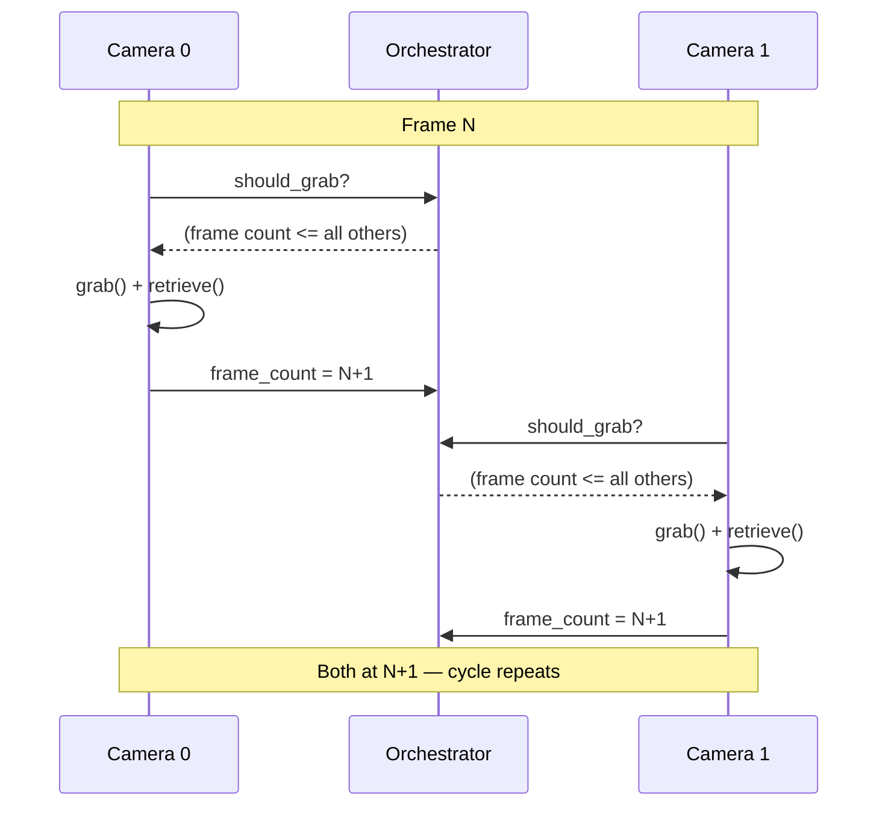

import { AiGeneratedBanner, CoreFeatureHeader } from '@freemocap/skellydocs';
import config from '@site/content.config';

<AiGeneratedBanner />

<CoreFeatureHeader feature={config.features.find(f => f.id === 'frame-perfect-sync')} repoUrl="https://github.com/freemocap/skellycam" />

## 问题

大多数多摄像头设置都存在**摄像头间漂移**问题。每个 USB 摄像头都有自己的内部时钟，以自己的速度传送帧。摄像头 A 可能产生 30.01 fps，而摄像头 B 运行在 29.97 fps。在 10 分钟的录制中，这个微小的差异会累积——摄像头最终会相差数十帧，摄像头 A 的"第 1000 帧"不再对应摄像头 B 的同一时刻。

这使得下游处理（三角测量、3D 重建、动作捕捉）变得不可靠或不可能，除非进行复杂的事后对齐。

## SkellyCam 如何解决

SkellyCam 使用**帧计数门控捕获协议**。每个摄像头在自己的进程中运行自己的捕获循环，但共享的 `CameraOrchestrator` 控制每个摄像头何时可以抓取下一帧：

1. **门控检查** — 在每次抓取前，摄像头询问协调器："我可以继续吗？"答案为**是**仅当该摄像头的帧计数是组中所有摄像头中最低的（或并列最低的）。

2. **抓取** — 一旦通过门控，摄像头调用 OpenCV 的 `grab()`，在驱动缓冲区中锁定传感器图像而不传输像素数据。因为 `grab()` 速度快，且所有摄像头被门控到相同的帧计数，摄像头间的时间差异很小。

3. **检索** — 摄像头调用 `retrieve()` 将锁定的帧解码为 numpy 数组。

4. **递增** — 摄像头的帧计数更新，这可能解除其他等待中的摄像头的门控。

关键洞察：没有摄像头比任何其他摄像头超前**一帧**以上。这在不需要显式集中屏障的情况下保持锁步推进。

## 录制期间

每个摄像头的 `cv2.VideoWriter` 在摄像头自己的进程中运行。协调器跟踪共享的 `first_recording_frame_number` 和 `last_recording_frame_number` 值。因为所有摄像头锁步推进，录制在相同的帧边界开始和停止，输出视频**保证具有相同的帧数**。

## 这对您意味着什么

如果您基于 SkellyCam 构建——无论是用于动作捕捉、多视角立体还是任何其他多摄像头应用——您可以将帧索引视为所有摄像头的可靠时间标识符。摄像头 A 的第 500 帧和摄像头 B 的第 500 帧大约在同一时刻捕获。无需对齐步骤。
