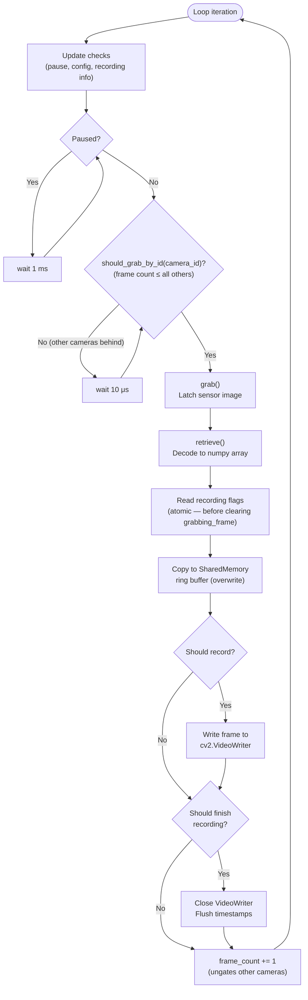
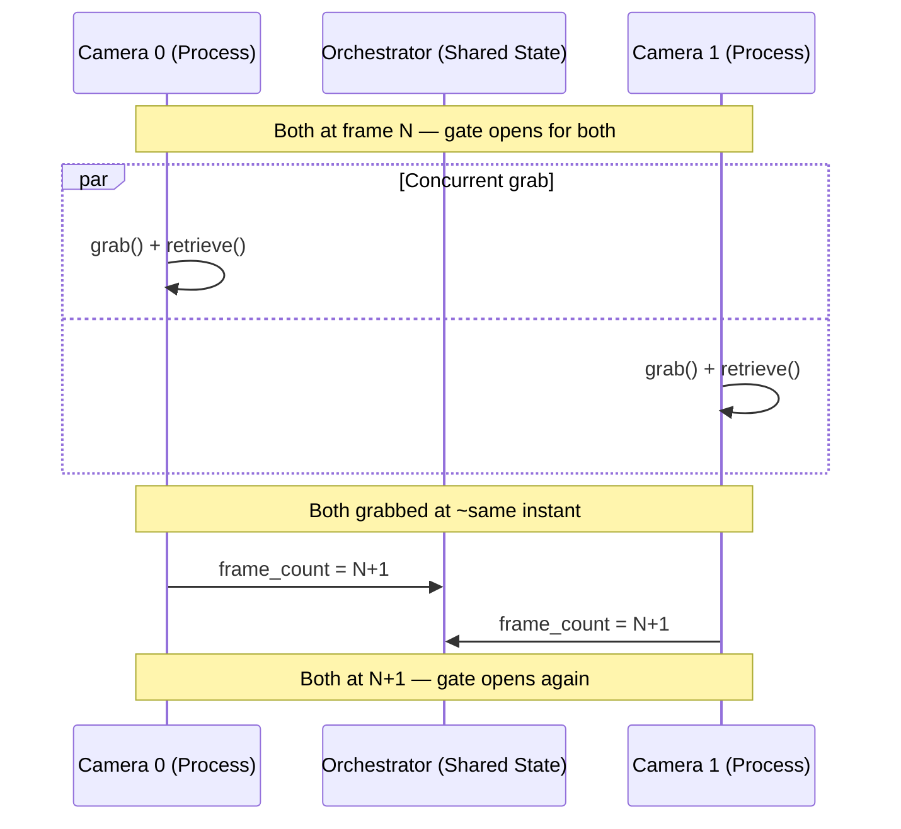

import { AiGeneratedBanner, Tip } from '@freemocap/skellydocs';

<AiGeneratedBanner humanCurated />

# 帧同步方法

本页面是对 SkellyCam 帧计数门控捕获协议的技术深入解析。如需更高层次的概述，请参阅[完美帧同步](/docs/core/frame-perfect-sync)。

整个帧同步系统是一个 <Tip shortInfo="任何延迟都会直接降低时间保真度的操作。" longInfo="SkellyCam 将操作分为热循环（时间关键的捕获）、硬循环（正确性关键的处理）和软循环（尽力而为的界面/流媒体）。" href="/docs/technical/architecture#hot-hard-and-soft-loops">**热循环**</Tip>——捕获周期中的每个操作都是时间关键的，任何延迟都会直接影响时间保真度。

## 捕获循环

每个摄像头在其自己的 `multiprocessing.Process` 中运行以下循环。该循环从摄像头连接的那一刻起持续运行，直到关闭。

:::info 这里"原子"的含义
在此上下文中，"原子"意味着录制标志相对于帧周期作为单个不可分割的操作被读取。标志值不会在读取和执行之间发生变化，因为 `grabbing_frame` 标志直到读取标志之后才会被清除。这可以防止录制开始/停止边界处的竞态条件以及最终视频中帧计数的偏差错误。
:::



### 逐步说明

| 步骤 | 操作 | 代码位置 | 备注 |
|------|------|----------|------|
| 1 | **更新检查** | `camera_loop_update_checks.py` | 检查暂停命令、配置更新和新的录制信息 |
| 2 | **暂停门控** | `opencv_camera_loop.py:66-68` | 如果 `is_paused`，自旋等待 1 毫秒并跳到下一次迭代 |
| 3 | **同步门控** | `camera_orchestrator.py:93-106` | `should_grab_by_id()` 仅当此摄像头的帧计数 ≤ 所有其他摄像头时返回 `True` |
| 4 | **抓取** | `opencv_get_frame.py` | `cv2.VideoCapture.grab()` — 在驱动缓冲区中锁存传感器图像 |
| 5 | **检索** | `opencv_get_frame.py` | `cv2.VideoCapture.retrieve()` — 将帧解码到预分配的 numpy recarray 中 |
| 6 | **录制标志** | `opencv_camera_loop.py:90-94` | 在清除 `grabbing_frame` **之前**读取标志以防止竞态条件 |
| 7 | **共享内存** | `camera_shared_memory_ring_buffer.py` | `put_frame(overwrite=True)` — 流消费者不会阻塞捕获 |
| 8 | **录制** | `handle_video_recording_loop.py` | 如果设置了 `should_record_frame`，则写入 `cv2.VideoWriter` |
| 9 | **完成** | `handle_video_recording_loop.py` | 如果设置了 `should_finish_recording`，则关闭写入器并刷新 |
| 10 | **递增** | `opencv_camera_loop.py` | 更新 `frame_count`，解除其他摄像头的门控 |

## 同步门控

`CameraOrchestrator` 通过 `should_grab_by_id()` 实施帧级同步：

```python
def should_grab_by_id(self, camera_id) -> bool:
    if not self.all_ready:
        return False
    return self._all_camera_counts_greater_than_or_equal_to_camera(camera_id)
```

摄像头只有在其帧计数是所有摄像头中**最低**的（或并列最低）时才能抓取下一帧。这确保没有任何摄像头比其他摄像头领先超过一帧。

所有摄像头同时轮询此门控——当它们都达到相同的帧计数时，它们几乎同时通过门控并在时间上紧密接近地抓取下一帧。



## 录制边界

录制的开始和停止通过编排器管理的共享 `multiprocessing.Value` 整数在所有摄像头之间协调：

- `first_recording_frame_number` — 录制开始时设置。初始值为 `-1`。
- `last_recording_frame_number` — 录制停止时设置。初始值为 `-1`。

每个摄像头在每帧都会检查这些值：

```python
def should_record_frame_number(self, frame_number: int) -> tuple[bool, bool]:
    should_record_frame = False
    should_finish_recording = False

    if self.first_recording_frame_number.value != -1:
        if frame_number >= self.first_recording_frame_number.value:
            should_record_frame = True

    if self.last_recording_frame_number.value != -1:
        if frame_number < self.last_recording_frame_number.value:
            should_record_frame = True
        elif frame_number >= self.last_recording_frame_number.value:
            should_record_frame = False
            should_finish_recording = True

    return should_record_frame, should_finish_recording
```

### 防止偏差错误

录制标志在**帧抓取之后、`grabbing_frame` 标志清除之前**立即读取：

```python
# CRITICAL: Get recording flags BEFORE unsetting 'grabbing_frame'
# to avoid potential race-condition-generating flag setting gaps
(should_record_frame,
 should_finish_recording) = orchestrator.should_record_frame_number(
    frame_number=frame_rec_array.frame_metadata.frame_number[0])

self_status.grabbing_frame.value = False  # Only AFTER reading flags
```

这种顺序防止了录制边界在读取标志和使用标志之间发生变化的竞态条件。因为所有摄像头都是锁步运行的，它们都在相同的帧号处跨过录制边界，从而产生具有相同帧数的视频。

## 暂停和配置更新

### 暂停

暂停由编排器的 `pause()` / `unpause()` 方法控制，这些方法在所有摄像头上设置 `should_pause` 并等待 `is_paused` 传播：

```python
if self_status.is_paused.value:
    wait_1ms()
    continue  # Skip frame grab entirely
```

暂停时，摄像头以 1 毫秒间隔自旋等待。这对交互使用来说响应足够快，同时消耗极少的 CPU。

### 配置更新

配置更新（分辨率、曝光、编解码器更改）在每次循环迭代开始时检查：

```python
if not update_camera_settings_subscription.empty():
    self_status.updating.value = True
    extracted_config = apply_camera_configuration(cv2_video_capture, new_config)
    self_status.updating.value = False
```

当摄像头正在更新（`updating.value = True`）时，编排器的 `all_ready` 属性返回 `False`，这会阻止所有摄像头抓取。这确保配置更改不会在帧周期中途发生。

## 摄像头状态标志

每个摄像头维护一组 `multiprocessing.Value` 布尔标志，用于跨进程协调：

| 标志 | 用途 |
|------|------|
| `connected` | 摄像头硬件已初始化并就绪 |
| `grabbing_frame` | 当前处于抓取/检索周期中 |
| `recording_in_progress` | VideoRecorder 处于活动状态 |
| `is_recording_frame` | 当前正在将帧写入磁盘 |
| `is_paused` | 已暂停（未抓取） |
| `should_pause` | 已收到暂停命令 |
| `updating` | 配置更新进行中 |
| `frame_count` | 最后抓取的帧号（`multiprocessing.Value('q')`） |
| `error` / `closing` / `closed` | 错误和关闭状态 |

`ready` 属性控制编排器的门控：

```python
@property
def ready(self) -> bool:
    return all([self.connected,
                not self.should_pause,
                not self.should_close,
                not self.closing,
                not self.closed,
                not self.updating,
                not self.error])
```

## 初始化屏障

在主循环开始之前，所有摄像头必须完成初始化：

1. 连接硬件并发布提取的配置
2. 等待主进程完成共享内存设置
3. 设置 `connected = True`
4. 等待**所有**摄像头设置 `connected = True`（通过 `orchestrator.all_ready` 实现屏障）
5. 通过读取虚拟帧清除硬件缓冲区
6. 使用 `frame_number = -1` 初始化帧 recarray

只有在此之后，同步捕获循环才会开始——确保所有摄像头从第 0 帧一起开始。

## 错误处理

如果任何摄像头遇到错误：

1. `signal_error()` 设置 `error = True` 和 `connected = False`
2. `ipc.kill_everything()` 设置全局终止标志
3. `finally` 块确保任何正在进行的录制被完成（关闭视频文件、刷新时间戳）
4. 摄像头的共享内存被关闭，OpenCV 捕获被释放

这确保即使在崩溃场景中，录制数据也能尽可能完整地保留。
