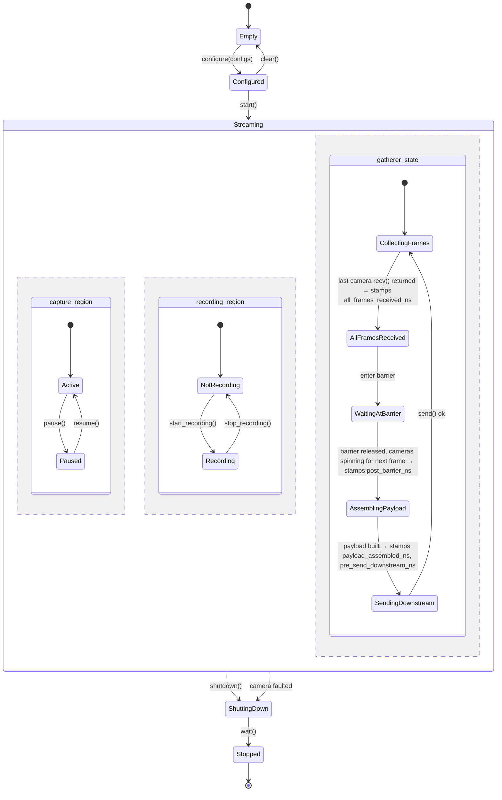

<!-- Auto-generated by tests/state_diagrams.rs — do not edit by hand. -->
<!-- Source of truth: src/camera_group/state_machine.rs StateDiagram impl. -->

# CameraGroup State Machine

```mermaid
stateDiagram-v2
    [*] --> Empty

    Empty --> Configured : configure(configs)
    Configured --> Streaming : start()
    Configured --> Empty : clear()

    Streaming --> ShuttingDown : shutdown()
    Streaming --> ShuttingDown : camera faulted

    ShuttingDown --> Stopped : wait()
    Stopped --> [*]

    state Streaming {
        state capture_region {
            [*] --> Active
            Active --> Paused : pause()
            Paused --> Active : resume()
        }
        --
        state recording_region {
            [*] --> NotRecording
            NotRecording --> Recording : start_recording()
            Recording --> NotRecording : stop_recording()
        }
        --
        state gatherer_state {
            [*] --> CollectingFrames
            CollectingFrames --> AllFramesReceived : last camera recv() returned → stamps all_frames_received_ns
            AllFramesReceived --> WaitingAtBarrier : enter barrier
            WaitingAtBarrier --> AssemblingPayload : barrier released, cameras spinning for next frame → stamps post_barrier_ns
            AssemblingPayload --> SendingDownstream : payload built → stamps payload_assembled_ns, pre_send_downstream_ns
            SendingDownstream --> CollectingFrames : send() ok
        }
    }

```
