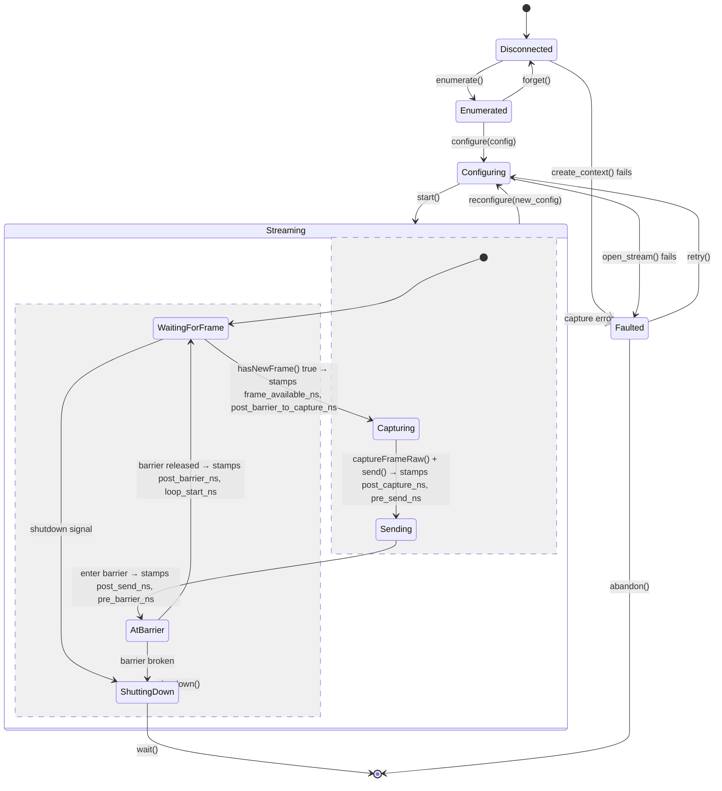

<!-- Auto-generated by tests/state_diagrams.rs — do not edit by hand. -->
<!-- Source of truth: src/camera/state_machine.rs StateDiagram impl. -->

# Camera State Machine

```mermaid
stateDiagram-v2
    [*] --> Disconnected

    Disconnected --> Enumerated : enumerate()
    Disconnected --> Faulted : create_context() fails

    Enumerated --> Configuring : configure(config)
    Enumerated --> Disconnected : forget()

    Configuring --> Streaming : start()
    Configuring --> Faulted : open_stream() fails

    Streaming --> Configuring : reconfigure(new_config)
    Streaming --> ShuttingDown : shutdown()
    Streaming --> Faulted : capture error

    ShuttingDown --> [*] : wait()

    Faulted --> Configuring : retry()
    Faulted --> [*] : abandon()

    state Streaming {
        [*] --> WaitingForFrame
        WaitingForFrame --> Capturing : hasNewFrame() true → stamps frame_available_ns, post_barrier_to_capture_ns
        Capturing --> Sending : captureFrameRaw() + send() → stamps post_capture_ns, pre_send_ns
        Sending --> AtBarrier : enter barrier → stamps post_send_ns, pre_barrier_ns
        AtBarrier --> WaitingForFrame : barrier released → stamps post_barrier_ns, loop_start_ns
        --
        WaitingForFrame --> ShuttingDown : shutdown signal
        AtBarrier --> ShuttingDown : barrier broken
    }

```
