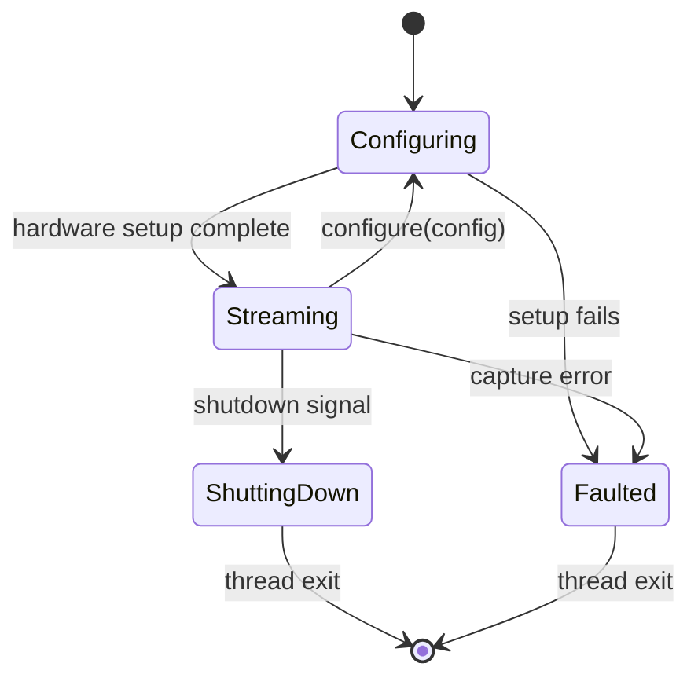
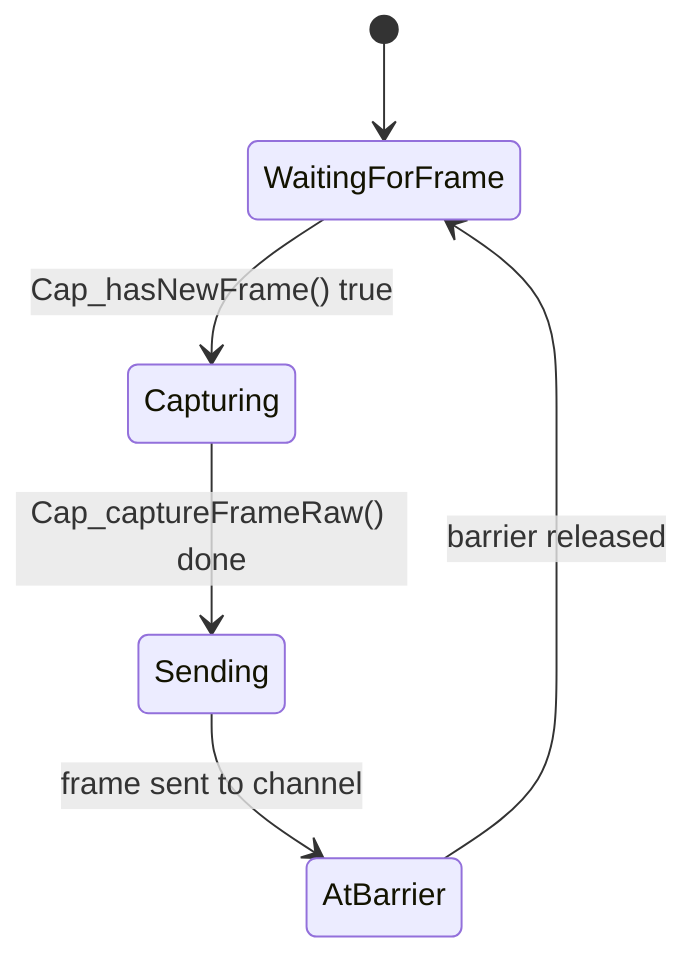

# Camera Module

Representation of a physical USB camera device. Each camera runs on its own OS thread
with a thread-affine DirectShow COM context (via openpnp-capture).

**Cameras are always used through the camera group abstraction.** The camera group
owns the barrier synchronization between cameras. This README shows the camera API
surface; in production, `CameraGroup` handles lifecycle orchestration. Solo
operation (barrier-based, as shown in the tests) is only used for testing.

## Quick Start

```rust
use std::sync::Arc;
use skellycam::camera::{detect_cameras, Camera, CameraConfig};
use skellycam::camera_group::sync_utils::BreakableBarrier;

fn main() -> anyhow::Result<()> {
    // 1. Find cameras attached to the system
    let identities = detect_cameras()?;
    let identity = identities.into_iter().next().expect("no camera found");

    // 2. Configure and start (barrier(2): camera thread + gatherer/test code)
    let config = CameraConfig {
        camera_id: identity.camera_id.clone(),
        camera_index: identity.camera_index as u32,
        width: 640,
        height: 480,
        exposure: -7,
        exposure_mode: "MANUAL".into(),
        framerate: 30.0,
        rotation: -1,
    };
    let barrier = Arc::new(BreakableBarrier::new(2));
    let paused = Arc::new(AtomicBool::new(false));
    let camera = Camera::start(identity, config, barrier.clone(), paused, 0)?;

    // 3. Read frames — poll in a loop, call barrier.wait() after each frame
    //    so the camera thread can continue its capture cycle.
    let mut last_loop_start_ns: i64 = 0;
    for _ in 0..30 {
        match camera.try_recv_frame() {
            Ok(frame) => {
                if last_loop_start_ns > 0 {
                    let interval_ns = frame.timestamps.loop_start_ns - last_loop_start_ns;
                    let fps = 1_000_000_000.0 / interval_ns as f64;
                    println!("Frame {}: {:.1} FPS", frame.frame_number, fps);
                }
                last_loop_start_ns = frame.timestamps.loop_start_ns;
                barrier.wait(); // release camera thread for next frame
            }
            Err(std::sync::mpsc::TryRecvError::Empty) => {
                std::thread::sleep(std::time::Duration::from_millis(1));
            }
            Err(_) => break,
        }
    }

    // 4. Shut down gracefully
    barrier.break_barrier();
    camera.shutdown()?;
    Ok(())
}
```

## Architecture

```
┌──────────────────────────────────────────────────┐
│  CAMERA THREAD (persistent, owns COM context)     │
│                                                   │
│  Internal state machine:                          │
│  Configuring ──→ Streaming ──→ ShuttingDown       │
│       │               │              │            │
│       └──────→ Faulted ←─────────────┘            │
│                                                   │
│  Frame loop (every ~33ms at 30fps):               │
│  WaitingForFrame → Capturing → Sending → AtBarrier│
│                                                   │
│  Channels:                                        │
│    ← commands (Configure, Shutdown)               │
│    → frames (FramePacket, capacity 1)             │
│    → events (Error)                               │
└──────────────────────────────────────────────────┘
         ▲                              ▲
         │ commands                     │ frames/events
         │                              │
┌────────────────────┐                  │
│  Camera (handle)   │──────────────────┘
│  - cmd_sender      │
│  - frame_receiver  │
│  - event_receiver  │
│  - thread_handle   │
│  - identity        │
│  - config          │
└────────────────────┘
```

The camera thread IS the camera. The `Camera` struct is a handle for communicating
with it. The thread persists from `start()` to `shutdown()` — config changes are
applied on the existing thread and COM context, not by destroying and recreating.

### Channel protocol

Three channels connect the handle to the thread:

| Channel | Type | Direction | Purpose |
|---|---|---|---|
| Command | `mpsc::channel()` | handle → thread | `Shutdown` or `Configure { config }` |
| Event | `mpsc::channel()` | thread → handle | `Error(String)` on failure |
| Frame | `mpsc::sync_channel(1)` | thread → handle | `FramePacket` with capacity-1 backpressure |

The sync_channel with capacity 1 means the camera thread blocks on `send()` until
the gatherer consumes the previous frame. This provides natural backpressure —
the camera thread cannot get ahead of the consumer by more than one frame.

## Files

| File | Purpose |
|---|---|
| `camera.rs` | Public `Camera` handle — the interface to the outside world |
| `camera_thread.rs` | Thread spawn + main loop with internal state machine |
| `frame_loop.rs` | `FrameStateMachine` — timestamps and validation for the hot loop |
| `detect.rs` | Hardware discovery via openpnp-capture |
| `ffi.rs` | Raw C bindings to openpnp-capture |
| `types.rs` | Data types: config, identity, frame packets, timestamps, channels |

## Internal Thread State Machine



## Frame Loop (inside Streaming)



## Design Decisions

**Thread IS the camera.** The openpnp-capture COM context is thread-affine. It must
be created, used, and destroyed on the same OS thread. The thread owns the context
and persists for the device's lifetime. The `Camera` handle communicates via channels.

**Enum state machine, not type-state.** Type-state (where each lifecycle state is a
distinct Rust type) forces state transitions to consume `self`, which means the
thread handle gets moved between types and dropped on transition. This orphans
threads and breaks COM affinity. A plain enum inside the persistent thread is simpler
and correct.

**Capture-then-barrier sync.** Each camera thread captures a frame independently,
THEN waits at the barrier. This means USB transfer and JPEG copy happen in parallel
across cameras. The barrier is the cycle-completion signal, not the cycle-start
signal. `post_barrier_to_capture_ns` measures scheduling jitter: how quickly the OS
wakes each camera thread after barrier release.

**External detection.** `detect_cameras()` is a free function that returns
`Vec<CameraIdentity>`. The camera does not detect itself — it receives an identity
at construction. This keeps the `Camera` type focused on representing a single
device, not managing discovery.

## Camera ID Algorithm

Each camera gets a unique 4-character hex identifier by SHA-256 hashing all
available identity fields (index, camera name, device path, VID/PID) into one
string and taking the last 4 hex characters of the digest. Every field the OS
reports contributes to the fingerprint — no branching fallbacks. This produces
stable IDs across Mac, Windows, and Linux.

## Format Selection (3-pass)

`find_best_mjpg()` in `camera_thread.rs` searches for the best raw MJPEG format:

1. **Exact resolution + framerate** — matches requested width, height, and FPS
2. **Exact resolution, best framerate** — matches resolution, picks closest FPS
3. **Any MJPG (fallback)** — picks the first MJPG format available

Only raw MJPEG streams are used; RGB decoding is deferred to the consumer.

## Dependencies

| Dependency | Used in | Purpose |
|---|---|---|
| `openpnp-capture` (C lib) | `ffi.rs` | DirectShow camera access via COM |
| `sha2` | `detect.rs` | SHA-256 for camera ID hashing |
| `BreakableBarrier` | `camera_thread.rs` | Multi-camera frame synchronization |
| `performance_counter_nanoseconds()` | `frame_loop.rs` | Monotonic nanosecond clock for timestamps |

## Build

```bash
# Always use --release — debug mode is too slow for the camera hot loop
cargo build --release

# Build with tracing output for debugging
RUST_LOG=info cargo build --release
RUST_LOG=debug cargo build --release
```

## Running Tests

```bash
# All camera module tests (both unit and hardware)
cargo test --release camera::

# Unit tests only — no hardware needed (FrameStateMachine, transitions, timestamps)
cargo test --release camera::frame_loop::tests::

# Hardware tests — require at least one camera attached
# These run the full cycle: detect, start, read frames, check FPS/image stats, shutdown
cargo test --release camera::camera::tests::

# Run a single test by name
cargo test --release camera::camera::tests::full_lifecycle_read_frames_and_framerate
cargo test --release camera::camera::tests::configure_mid_stream_changes_exposure
cargo test --release camera::camera::tests::frame_timestamps_are_populated
```

### Hardware tests

The hardware tests (in `camera.rs`) assume at least one physical camera is attached.
They verify:

- **Detection** — `detect_cameras()` finds at least one device
- **Full lifecycle** — detect → start → read 30 frames → compute FPS/JPEG stats → shutdown
- **Mid-stream configure** — read 15 frames, change exposure, read 15 more, verify valid JPEGs
- **Timestamp integrity** — all 7 timestamp fields are non-zero and causally ordered
- **Accessor correctness** — `identity()` and `config()` return the expected values

Each test creates a `BreakableBarrier(2)` and the test code participates as the
"gatherer" — calling `barrier.wait()` after each `try_recv_frame()` — to simulate
the role the camera group normally plays in production.
