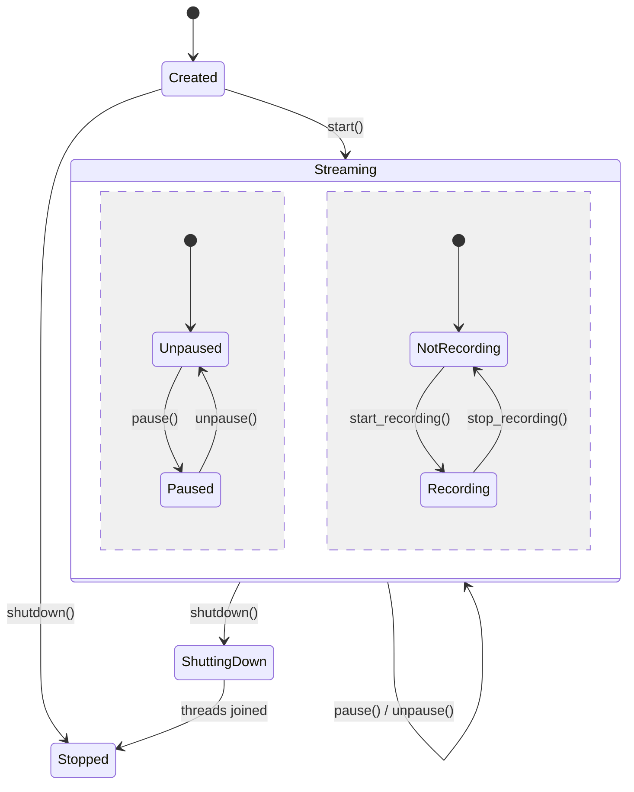
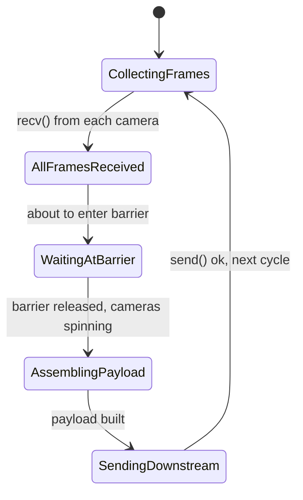

# Camera Group Module

Manages a synchronized group of USB cameras. From the outside, it behaves like a single
camera — you configure it, start it, read frames, and shut it down. Internally, it
maintains N cameras synchronized through a shared `BreakableBarrier`.

## Quick Start

```rust
use std::collections::HashMap;
use skellycam::camera::{detect_cameras, CameraConfig};
use skellycam::camera_group::{CameraGroup, CameraGroupConfig};

fn main() -> anyhow::Result<()> {
    // 1. Detect hardware
    let identities = detect_cameras()?;

    // 2. Build config map: camera_id → CameraGroupConfig
    let mut configs = HashMap::new();
    for identity in identities {
        let config = CameraConfig {
            camera_id: identity.camera_id.clone(),
            camera_index: identity.camera_index as u32,
            width: 640,
            height: 480,
            exposure: -7,
            exposure_mode: "MANUAL".into(),
            framerate: 30.0,
            rotation: -1,
        };
        configs.insert(identity.camera_id.clone(), CameraGroupConfig {
            identity,
            capture_config: config,
        });
    }

    // 3. Create and start the group
    let mut group = CameraGroup::new(configs);
    group.start()?;

    // 4. Read synchronized multiframes by polling the frontend payload
    for _ in 0..100 {
        std::thread::sleep(std::time::Duration::from_millis(1));
        if let Some(payload) = group.latest_frontend_payload() {
            println!("Multiframe {}: {} cameras, {} total bytes",
                payload.frame_number,
                // payload.jpeg_bytes is the encoded frontend binary
                payload.jpeg_bytes.len(),
            );
        }
    }

    // 5. Shut down
    group.shutdown()?;
    Ok(())
}
```

## Architecture

```
┌──────────────────────────────────────────────────────┐
│  CAMERA THREADS (one per physical device)             │
│                                                       │
│  Camera 0 ── Capture loop ── barrier.wait() ── repeat │
│  Camera 1 ── Capture loop ── barrier.wait() ── repeat │
│  Camera N ── Capture loop ── barrier.wait() ── repeat │
│                                                       │
│  Each camera captures independently, THEN hits the    │
│  barrier. USB transfer + JPEG copy happen in parallel.│
└──────────────────────────────────────────────────────┘
         │ frame channels              ▲ barrier
         ▼                            │
┌──────────────────────────────────────────────────────┐
│  GATHERER THREAD                                     │
│                                                       │
│  Cycle:                                               │
│  CollectingFrames → AllFramesReceived →               │
│  WaitingAtBarrier → barrier.wait() →                  │
│  AssemblingPayload → SendingDownstream → repeat       │
│                                                       │
│  Collects one frame from each camera, hits the        │
│  barrier to release all cameras simultaneously,       │
│  then assembles and sends MultiFramePayload while     │
│  cameras spin for their next frame.                   │
└──────────────────────────────────────────────────────┘
         │
         ▼
┌──────────────────────────────────────────────────────┐
│  CameraGroup (handle)                                 │
│  - cameras: HashMap<CameraId, Camera>                 │
│  - configs: HashMap<CameraId, CameraGroupConfig>      │
│  - paused: Arc<AtomicBool>                             │
│  - state: CameraGroupState (runtime enum)             │
│  - multi_frame_receiver                               │
└──────────────────────────────────────────────────────┘
```

## State Diagram



## Gatherer Cycle (inside Streaming)



When paused, the gatherer still completes the full cycle through
`WaitingAtBarrier` (cameras are released) but skips the downstream send.

## Files

| File | Purpose |
|---|---|
| `camera_group.rs` | Public `CameraGroup` handle — lifecycle, frame polling, recording |
| `gatherer.rs` | Gatherer thread — collects frames, hits barrier, assembles multiframes + stats |
| `dispatcher.rs` | Dispatcher thread — encodes frontend payload, manages recording (ffmpeg+CSV) |
| `sync_utils.rs` | `BreakableBarrier` — multi-thread synchronization with shutdown support |
| `types.rs` | Data types: `CameraGroupConfig`, `DispatcherCommand`, `RecordingParams` |
| `frontend_encoder.rs` | Binary protocol encoder for frontend WebSocket payloads |
| `jpeg_transform.rs` | Lossless JPEG rotation via libjpeg-turbo `tjTransform` |
| `recording_stats.rs` | Per-recording statistics aggregation |

## Public API

```rust
impl CameraGroup {
    // Lifecycle
    pub fn new(configs: HashMap<String, CameraGroupConfig>) -> Self
    pub fn start(&mut self) -> anyhow::Result<()>
    pub fn apply(&mut self, configs: HashMap<String, CameraGroupConfig>) -> anyhow::Result<()>
    pub fn shutdown(&mut self) -> anyhow::Result<()>

    // Frame polling (push-to-slot — dispatcher writes, you read)
    pub fn latest_frontend_payload(&self) -> Option<FrontendPayload>
    pub fn latest_raw_frames(&self) -> Option<Vec<RawFrame>>
    pub fn latest_performance_snapshot(&self) -> Option<String>

    // Capture control
    pub fn pause(&mut self)
    pub fn unpause(&mut self)
    pub fn toggle_pause(&mut self)
    pub fn is_paused(&self) -> bool
    pub fn is_alive(&self) -> bool

    // Recording
    pub fn start_recording(&mut self, params: RecordingParams) -> anyhow::Result<()>
    pub fn stop_recording(&mut self) -> anyhow::Result<RecordingSummary>
    pub fn is_recording(&self) -> bool

    // Accessors
    pub fn camera_count(&self) -> usize
    pub fn state(&self) -> CameraGroupState
    pub fn group_id(&self) -> &str
    pub fn camera_statuses(&self) -> Vec<CameraStatus>
}
```

## Design Decisions

**Runtime enum, not type-state.** The camera group owns OS threads, channel endpoints,
and an `Arc<BreakableBarrier>`. These must persist across state changes. Type-state
(`CameraGroup<S>`) would move these resources between types on each transition,
potentially orphaning threads. A plain runtime enum (`CameraGroupState`) lives inside
a persistent struct that owns all resources for the group's entire lifetime.

**Pause releases cameras.** When paused, the gatherer still collects frames from all
cameras and releases the barrier — cameras continue their capture loop unimpeded.
This keeps camera threads responsive to config changes and shutdown signals. The only
difference is the gatherer skips the downstream `send()` of the `MultiFramePayload`.

**Camera handles, not CameraHandle.** The new `Camera` type from the camera module
already provides command sending, frame receiving, identity, and config access.
`CameraHandle` was a redundant wrapper — `CameraGroup` stores `Camera` handles directly.

**idempotent `apply()`.** Calling `apply()` with the same configs repeatedly is a
no-op. Changing configs for existing cameras sends `Configure` commands via the
camera's channel. Adding/removing cameras updates the camera set and barrier count.

**External detection.** Like the camera module, the group does not detect cameras
itself. It receives an identity and config for each camera from the caller. Detection
is a separate concern handled by `detect_cameras()` in the camera module.

## Build

```bash
# Always use --release — debug mode is too slow for the camera hot loop
cargo build --release

# Check compilation only (faster than full build)
cargo check --release
```

## Running Tests

```bash
# Camera group unit tests (GathererStateMachine transitions, state validation)
cargo test --release camera_group::

# Camera hardware tests (require at least one camera attached)
cargo test --release camera::
```
